# Оглавление

- [💎Определение](#-определение)
- [💡Концепция фраемворка](#-концепция-фраемворка)
- [🏞 Кэширование изображений](#-кэширование-изображений)
  - [Общие настройки для каждого подхода кэширования](#%EF%B8%8F-общие-настройки-для-каждого-подхода-кэширования)
  - [Битовая маска RXWC_ImageViewOptions](#0%EF%B8%8F⃣-1%EF%B8%8F⃣-битовая-маска-rxwc_imageviewoptions)
  - [Дуализм значений в битовых масках](#%EF%B8%8F-дуализм-значений-в-битовых-масках)
  - [Срок годности элементов в кэше](#-срок-годности-элементов-в-кэше)
  - [Проперти класса RXWebCache связанные с кэшированием изображений](#--проперти-класса-rxwebcache-связанные-с-кэшированием-изображений)
  - [Кэширование картинок с помощью категории UIImageView+RXWC](#кэширование-картинок-с-помощью-категории-uiimageviewrxwc)
  - [Кэширование картинок с помощью RXWC_ReceiveImageOperation](#кэширование-картинок-с-помощью-rxwc_receiveimageoperation)
- [📖Кэширование json файлов с помощью RXWC_ReceiveDictionaryOperation](#-кэширование-json-файлов-с-помощью-RXWC_ReceiveDictionaryOperation)
- [💾Кэширование любых данных с помощью RXWC_RecievieItemOperation](#-кэширование-любых-данных-с-помощью-RXWC_RecievieItemOperation)
- [🚀RXWebCache](#-RXWebCache)
  - [Обзор Writing методов](#обзор-Writing-методов)
  - [Обзор Fetching методов](#обзор-Fetching-методов)
  - [Обзор Removing методов](#обзор-Removing-методов)
  - [Обзор Sandbox методов](#обзор-Sandbox-методов)
  - [Обзор Helper методов](#обзор-Helper-методов)
- [🗄RXWC_ItemCollection](#-RXWC_ItemCollection)
- [🗂Как устроена структура файлов и папок в песочнице](#-как-устроена-структура-файлов-и-папок-в-песочнице)
- [🏎 Технологии которые используются внутри RXWebCache](#-Технологии-которые-используются-внутри-RXWebCache)
- [🍫Рекомендации](#-рекомендации)
- [🎖Тесты производительности](#-тесты-производительности)
- [📲 Совместимость](#-совместимость)
- [🎯Как подключить фраемворк к проекту](#-как-подключить-фраемворк-к-проекту)
- [📜История создания](#-история-создания)
- [🛣Перспективы использования](#-Перспективы-использования)
- [🗿Философия архитектуры фраемворка](#-философия-архитектуры-фраемворка)
- [🧬Кредо фраемворка](#-кредо-фраемворка)
- [🗃Предназначение каждого класса](#-Предназначение-каждого-класса)
  - [Главный класс](#Главный-класс)
  - [Операции (наследники NSOperation)](#операции-наследники-nsoperation)
  - [Публичные категории](#публичные-категории)
  - [Модели](#модели)
  - [Коллекции](#коллекции)
  - [Групповая запись](#Групповая-запись)
  - [Тесты](#тесты)
- [👨🏼‍💻Автор](#Автор)
- [👀Дополнительно](#Дополнительно) 

<br>

## 💎 Определение

**RXWebCache** - это мощный инструмент, который помогает вам кэшировать данные из интернета.

<p align="center">
  
</p>

<br>

Высоко оптимизированные методы записи и отрисовки изображений  - позволяют достичь потрясающей производительности в `60 FPS` , которая поразит ваших пользователей легкостью и плавностью работы. 

<br>

По результатам проведенных исследований, фраемворк **RXWebCache** можно назвать - лидером мобильного рынка в кэшировании изображений.

<br>
<br>

<p align="center">
  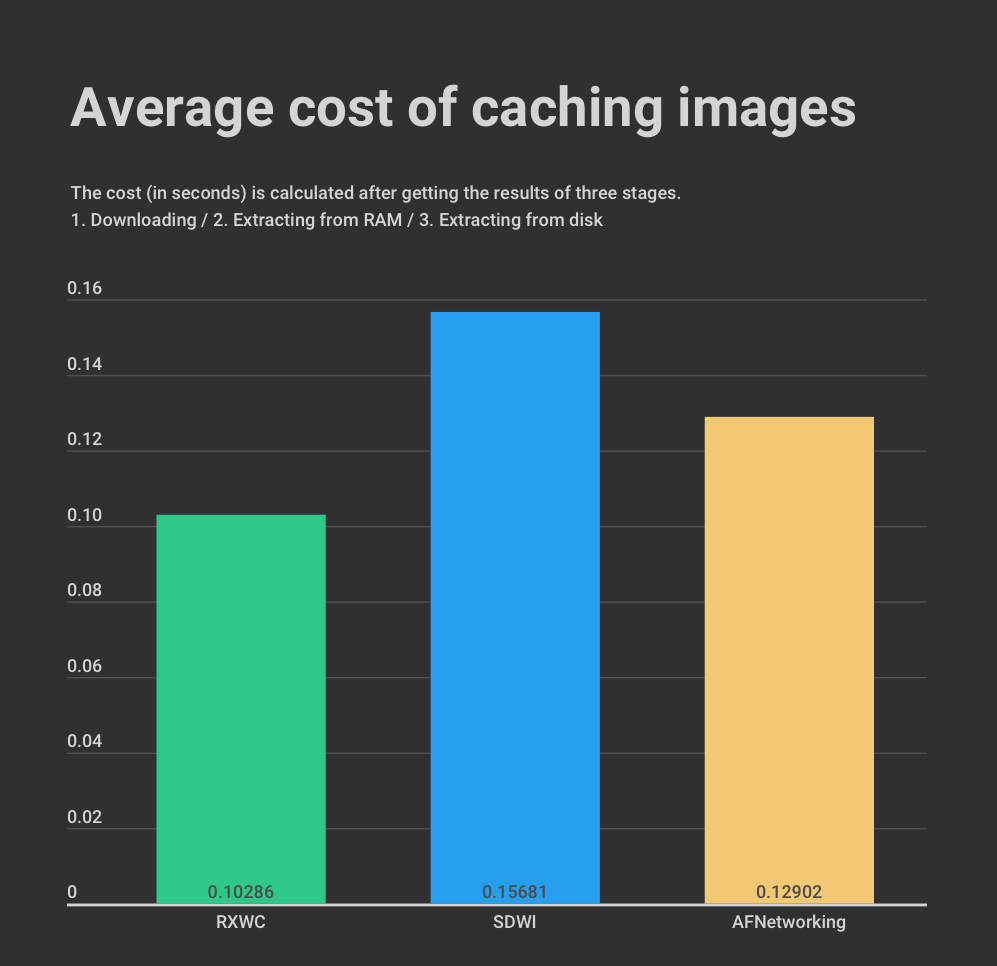
</p>

На этом графике представлен сравнительный тест производительности трех ведущих мобильных технологий.

Тестирование происходит в три этапа.

1) Изображения скачиваются и кэшируются.

2) Изображения извлекаются из кэша в оперативной памяти.

3) Изображения извлекаются извлекаются из кэша на диске.

**Средне арифметические числа указанные на графике, содержат усредненную скорость полученную из сложения временных показателей  каждого этапа тестирования (скачивания/извлечение из RAM/извлечение с диска).*

<br>

## 💡 Концепция фраемворка

Концепция фраемворка базируется на том что существуют два базовых класса которые управляют всем кэшем.

**RXWebCache** - взаимодействует только с локальным хранилищем.<br>
**RXWC_RecievieItemOperation** - взаимодействует с локальным хранилищем и в случае надобности скачивает данные из интернета.
<br>

.png)

<br>

## 🏞 Кэширование изображений

Кэшировать изображение вы можете используя два разных подхода:

| 1)  | Использовать категорию `UIImageView+RXWC` (только асинхронные методы).                                                                                                                                                                                                                       |
|:--- |:-------------------------------------------------------------------------------------------------------------------------------------------------------------------------------------------------------------------------------------------------------------------------------------------- |
|     | Что воспользоваться этим подходом, вам потребуется иметь экземпляр `UIImageView` от имени которого будет вызван метод кэширования.<br>  <br>Плюс этого подход заключается в простоте использования. Вам нужно иметь только экземпляр `UIImageView`, всю остальную работу выполнит фраемворк. |

<br>
<br>

| 2)  | Создать объект-операцию класса `RXWC_RecievieImageOperation` (доступны синхронные методы также).                                                                                                                                                                                                                                                                                                                                                                                                                                |
|:--- |:------------------------------------------------------------------------------------------------------------------------------------------------------------------------------------------------------------------------------------------------------------------------------------------------------------------------------------------------------------------------------------------------------------------------------------------------------------------------------------------------------------------------------- |
|     | При таком подходе вам нужно будет каждый раз инициализировать операцию, запускать вручную или ставить в очередь.<br>  <br>А после удачной процедуры скачивания вставлять экземпляр `UIImage` в `UIImageView`.<br>  <br>Один из плюсов такого подхода состоит в том, что класс `RXWC_ReceiveImageOperation` поддерживает синхронный режим кэширования.<br>  <br>То есть это может позволить вам избежать `callback-hell` в ситуациях когда вам нужно дождаться загрузки всех компонентов. И всех вместе их отобразить на экране. |

<br>

### ⚙️ Общие настройки для каждого подхода кэширования

### 🎭0️⃣ 1️⃣ Битовая маска RXWC_ImageViewOptions

Если захотите кэшировать изображения с помощью библиотеки **RXWebCache**, вы непременно столкнетесь с битовой маской `RXWC_ImageViewOptions`.

Данная маска содержит все возможные настройки связанные кэшированием и от рисовкой картинок.

**Возможности которые она предоставляет:**

| 🤖  | Перечисление технологий на которых может быть от рисовано изображение                          |
| --- | ---------------------------------------------------------------------------------------------- |
| ✅   | **ImageIO**     (самая быстрая технология )⚡️ (рекомендуется для большинства средних картинок) |
| ✅   | **CoreGraphics**                                                                               |
| ✅   | **UIKit**                                                                                      |
| ✅   | **CoreImage**                                                                                  |
| ✅   | **VImage**                                                                                     |

<br>

| ⚙   | Параметры от рисовки изображения                                                              |
| --- | --------------------------------------------------------------------------------------------- |
| ✅   | Вернуть пользователю бинарный код чтобы он самостоятельно мог от рисовать картинку.           |
| ✅   | Обрезать ли картинку по краям `UIImageView` (если изображение выходит за границы)             |
| ✅   | Сжимать ли картинку если она больше чем размеры `UIImageView`                                 |
| ✅   | Возможность получить картинку оригинального размера (без обработки со стороны фраемворка)<br> |

<br>

| 🔍  | Настройки  поиска                          |
| --- | ------------------------------------------ |
| ✅   | Осуществлять ли поиск в оперативной памяти |
| ✅   | Осуществлять ли поиск на диске             |

<br>

| 🍭  | Прочие возможности которые предоставляет библиотека                                                       |
| --- | --------------------------------------------------------------------------------------------------------- |
| ✅   | Возможность выбирать поток на котором будет вызван `progressBlock`                                        |
| ✅   | Возможность выбирать поток на котором будет вызван `completionBlock`                                      |
| ✅   | Возможность решать хранить ли модель данных (с бинарным кодом) описывающих картинку в оперативной памяти. |
| ✅   | Хранить ли саму от рисованную картинку в оперативной памяти                                               |

<br>

Полный список параметров вы можете увидеть на картинке.
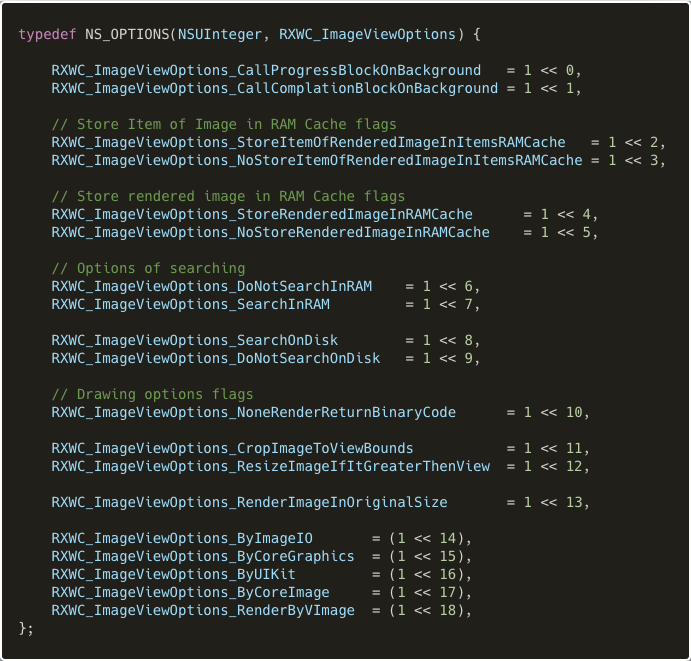

---

### 🎭❗️❓ Дуализм значений в битовых масках

Наверное вы заметили что одна и та же маска может иметь взаимоисключающие флаги, например такие, как `.SearchOnDisk` и `.DontSearchOnDisk`. <br>Наличие подобной двойственной реализации флагов нужно, для того чтобы иметь возможность максимально гибко настроить глобальные параметры кэширования и индивидуальные для каждой отдельной картинки.

К слову сказать значение переданное в параметр `options:(RXWC_ImageViewOptions)options` всегда будет иметь выше приоритет над значением `UIImageView.defaultOptions`.

Например если по умолчанию все картинки кэшируются в оперативную память, то если вы передадите флаг `.NoStoreRenderImageInRAMCache`, то конкретно это изображение не будет добавлено в `NSCache`.

---

### ⏰📅 Срок годности элементов в кэше

Если в методе который вы вызываете с целью кэшировать данные отсуствует аргумент который принимает время хранения в кэше, то время хранения элемента будет взято из проперти класса `RXWebCache`.

Значение по умолчанию равняется - `RXWC_OneDayTerm` (То есть элемент храниться в кэше ровно 24 часа).<br>
Кстати Вы можете редактировать его самостоятельно.

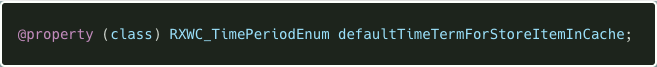

Также если вы не передадите "`время хранения`" в метод который принимает такой аргумент, или передадите невалидную дату, например `nil` в `NSDate`, или неверный `timeStamp`, или соответствующие значение `enum` - `RXWC_DontSaveInCache` то скаченный элемент не будет сохранен в БД.

---

### 🌁 💾 Проперти класса RXWebCache связанные с кэшированием изображений

Класс `RXWebCache` имеет коллекцию в которой Вы по собственному желанию можете хранить ранее скаченные и от рисованные изображения.

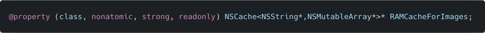

Как правило, это может быть очень полезно при работе с табличными представлениями. 
То есть когда вы прокручиваете список с картинками фраемворку не нужно каждый раз обращаться к БД на диске, загружать бинарный код и из него от рисовывать картинку.
Алгоритм просто достает уже готовое изображение из оперативной памяти.

Для этого вам потребуется установить соответствующий флаг `RXWC_ImageViewOptions_StoreRenderedImageInRAMCache` либо в `UIImageView.defaultOptions`, чтобы картинки всегда сохранялись в RAM, даже если вы явно не передали такой флаг в метод кэширования.
Либо передавать флаг каждый раз при вызове метода.

Кэш имеет следующую структуру:

```objectivec
/*--------------------------------------------------------------------------------------------
  Кэш хранит изображения разных размеров
  Структура кэша:
     @{             
      |  "url" : @[     // Под словарь который содержит разные params.
      |           |     // То есть может быть совершен запрос на один и тот же url,
      |           |     // но с разными params, тогда и картинки могут быть полученные разные. 
      |           |    @{  "params" : params,
      |           |     |  "expire" : date,
      |           |     |  "sizes"  : @{
      |           |     |              | nsValue(cgSize60x60) : image,
      |           |     |              | nsValue(cgSize80x80) : image,
      |           |     |              | nsValue(cgSize90x90) : image
      |           |     |              }
      |           |     }
      |           ],
      }
 --------------------------------------------------------------------------------------------*/
```

Если в аргумент `options` Вы передадите флаг `RXWC_ImageViewOptions_ResizeImageIfItGreaterThenView`, то при условии что картинка больше чем `UIImageView`, она автоматически будет сжата до размеров `UIImageView`(с сохранением сторон и учетом значения в `contentMode`)

Поскольку алгоритмы фраемворка являются крайне оптимизированные, то если вы будете запрашивать одну и ту же картинку для разных `UIImageView` (с разными размерами), например фотография профиля пользователя, и маленькая аватарка, то внутренний механизм будет кэшировать копии разных размеров.
(Как это показано выше в структуре кэша).

---

К тому же `RXWebCache` позволяет установить ограничения по объему занимаемой оперативной памяти для всего кэша картинок.
И также можно установить ограничения для каждой отдельной картинки которую фраемворк будет пытаться добавить в кэш.

Например: "Нельзя чтобы размер одной картинки превышал 10МБ".

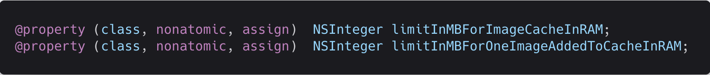

<br>

### Кэширование картинок с помощью категории UIImageView+RXWC

Категория **UIImageView+RXWC** имеет всего лишь одно публичное проперти.

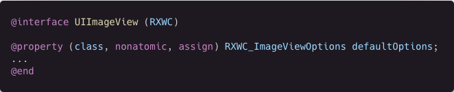

Такое проперти содержит настройки по умолчанию.
Требуются они для того чтобы, если вы не передали в метод какой-нибудь необходимый флаг, то он импортировался из проперти `defaultOptions`.<br>Например если вы не передали название технологии на который должна будет от рисовываться картинка.

---

- **Обзор методов из UIImageView+RXWC**

Ниже приведен в пример самый простой асинхронный метод категории. 

В качестве настроек в него были переданы флаги "`обрезания Фотографии По Границам UIImageView`" и 
"`отрисовка на технологии ImageIO`".

[Copy code](Documentation/TextSnippet/imgURL-options.txt)<br>
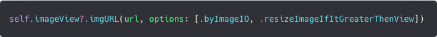

---

- **Сроки годности в UIImageView+RXWC**

Поскольку главная задача библиотеки это кэширование изображений перед нами логично встает вопрос отчистки кэша.

`Сonvenience` методы в категории `UIImageView+RXWC.h`  не имеют собственного параметра в который пользователь мог бы передать срок хранения изображения в кэше.

Поэтому время которое будут храниться элементы на диске будет браться из проперти `defaultTimeTermForStoreItemInCache` которое находится в классе `RXWebCache`. 

---

- **Категории со сроком годности**

Но если все же вы хотите собственноручно устанавливать сроки хранения для каждой отдельной картинки.
То обратите внимание на категории:
 (`RXWC_ExpireDateAsNSDate` / `RXWC_ExpireDateAsEnum` / `RXWC_ExpireDateAsTimeStamp`).

Они содержат методы которые, позволят Вам задавать сроки хранения в удобном для вас формате. <br>Вы можете передавать срок годности как объект `NSDate`, как enum `RXWC_TimePeriodEnum`, или строкой в формате `TimeStamp`.

**RXWC_ExpireDateAsNSDate**  - принимает `NSDate`.

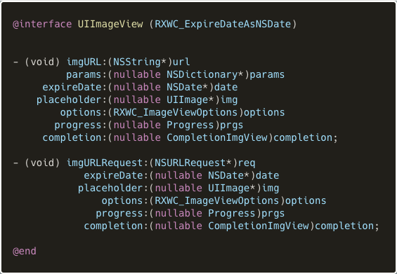

**RXWC_ExpireDateAsEnum** - принимает `enum RXWC_ImageViewOptions`.

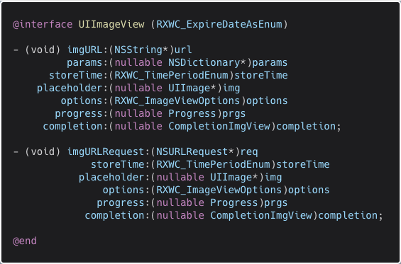

**RXWC_ExpireDateAsTimeStamp** - принимает `timeStamp NSString`.


---

- **UIImageView+RXWC вместе с табличными представлениями**

Самым популярным методом который кэширует картинки, является `-imgURL:options:progress:`. <br>Вызывайте его в методе `-collectionView:cellForItemAtIndexPath` (если используете `UICollectionView`).<br>И соответственно`-tableView:cellForRowAtIndexPath:` (если работаете с `UITableView`).

[Copy code](Documentation/TextSnippet/imgURL-options-progress.txt)<br>
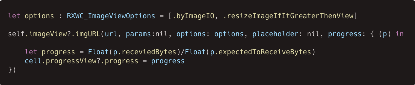

Также не забудьте **отменить** кэширование изображения если ячейка была скрыта с представления путем перелистывания.
Для этого вызовите метод `-cancelCachingImage` в соответствующих методах табличных представлениях.

Решение для `UICollectionView`:

[Copy code](Documentation/TextSnippet/collectionView-didEndDisplayingCell-forItemAtIndexPath.txt)<br>
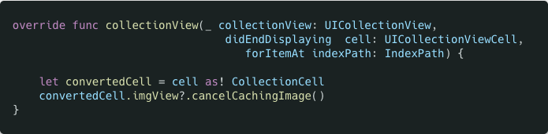

Решение для `UITableView`:

[Copy code](Documentation/TextSnippet/tableView-didEndDisplayingCell-forRowAtIndexPath.txt)<br>


---

- **UIImageView (RXWC_MethodWithArguments)**

Когда разрабатывалась категория `UIImageView+RXWC.h`, была задача продумать `convenience` методы на разные случаи.

Но придумать `convenience` методы на все возможные случаи просто невозможно.

Поэтому был разработан метод `-imgWithArguments:`, который принимает словарь с теми параметрами которые вы хотите передать. Например только `url` и `progressBlock`.

Ключи для словаря находятся в файле `RXWC_ReceiveItemOperation_PublicProtocols.h`.

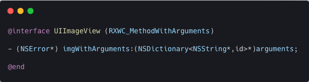

Если вдруг вы передадите недостаточное количество параметров в словаре, метод вернет вам ошибку.

**Пример использования метода:**

[Copy code](Documentation/TextSnippet/imgWithArguments.txt)

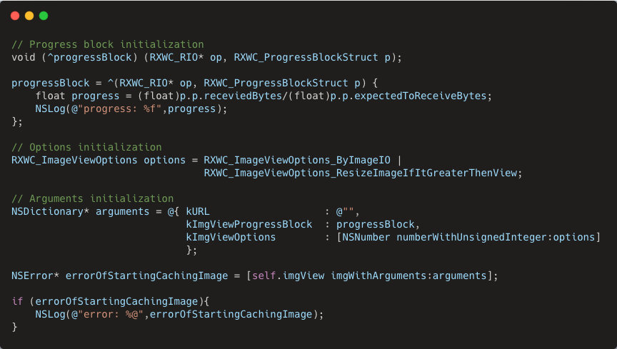

---

<br>

Также рекомендуем обратить внимание на это проперти находящиеся в классе **RXWebCache**.

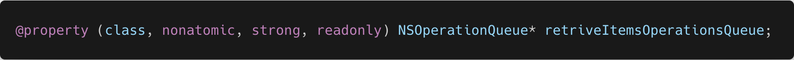

Все методы кэширования объявленные в категории `UIImageView+RXWC` внутри себя создают экземпляры операций `RXWC_RecievieItemOperation` которые всегда исполняются на очереди `retriveItemsOperationsQueue`.

Если вы используете методы кэширования из `UIImageView+RXWC` в табличных представлениях, где есть основания полагать что за несколько секунд прокрутки - пользователь захочет за кэшировать сотни картинок одновременно, вы можете (в зависимости от устройства) контролировать количество одновременно выполняемых операций на очереди.

По умолчанию это значение равняется **6** операциям.
Если вы считаете что данное значение не оптимально в вашем случае, то задайте другое значение.

```objectivec
RXWebCache.retriveItemsOperationsQueue.maxConcurrentOperationCount = 10;
```

---

<br>

### Кэширование картинок с помощью RXWC_ReceiveImageOperation

- **Синхронный подход**

Как уже было сказано ранее главное преимущество  **RXWC_ReceiveImageOperation** над **UIImageView+RXWC** это тот факт, что Вам не нужно иметь экземпляр `UIImageView` (для вызова метода кэширования) и то, что
есть возможность за кэшировать картинку синхронно.

**RXWC_ReceiveImageOperation** будет полезно если Вам необходимо сначала дождаться скачивания всех графических элементов, а потом всех вместе представить на контроллере.

Все синхронные методы начинаются с префикса `sync_`.

В примере который представлен ниже, синхронно скачиваются два изображения. <br>Весь код обернут в `GCD` блок чтобы не тормозить главный поток.<br>

⚠️ <u> Помните что синхронные методы блокируют тот поток на котором они были вызван.</u><br>       Поэтому если вы где-то еще используете стандартные очереди **GCD** (`dispatch_get_global_queue`),
       то вызывав метод кэширования на данной очереди вы заблокируете поток до самого момента 
       завершения выполнения операции.       

 Поэтому рекомендуется вызывать синхронные методы на собственноручно созданных очередях `GCD`.

[Copy code](Documentation/TextSnippet/RXWC_ReceiveImageOperation_sync_Case.txt)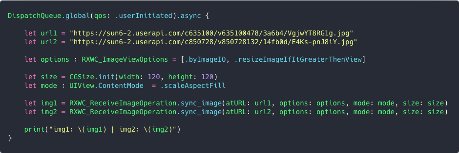

---

- **Асинхронный подход**

Тут представлен отрезок кода который совершает асинхронное кэширование картинки.<br>Обратите внимание что от имени операции вызывается метод `-retainOperationAndStart`.

Поскольку **RXWC_ReceiveImageOperation** является наследником класса **NSOperation**, то Вы имеете право выбрать способ как запустить операцию.

 **1)** Вы можете это сделать путем вставления операции в очередь (**NSOperationQueue**).
    Тогда очередь сама будет удерживать `strong` ссылку на операцию.

 **2)** Вызвать метод **-start**, но тогда вам самостоятельно нужно будет иметь strong ссылку на операцию.
      Чтобы она не была моментально удалена из памяти.

**3)** Вызывать метод   `-retainOperationAndStart` который с помощью внутреннего механизма сам будет удерживать strong ссылку на себя. А после сам удалиться из памяти.

Поэтому рекомендуется использовать метод  `-retainOperationAndStart`. <br>

[Copy code](Documentation/TextSnippet/RXWC_ReceiveImageOperation_async_Case.txt)


---

<br>

- ⚠️ На что обратить внимание когда используете **RXWC_ReceiveImageOperation**

| **Особенности взаимодействия с RXWC_ReceiveImageOperation**                                                                                                             |
| ----------------------------------------------------------------------------------------------------------------------------------------------------------------------- |
| **1)** Если вы передадите структуру **CGSizeZero** в параметр `size:(CGSize)sizeInPoints`, изображение будет от рисовано в оригинальную величину.                       |
| **2)** Также если метод не имеет параметра отвечающего за размер картинки, то картинка будет от рисована в оригинальную величину.                                       |
| **3)** Если вы передадите `nil` в `expireDate:(NSDate*)expireDate` или в `expireTimeStamp:(NSString*) expireTimeStamp` тогда скаченный элемент не будет  сохранен в БД. |
| **4)** Если метод не имеет параметра для срока хранения элемента в кэше, то это означает что значение будет взято из `RXWebCache.defaultTimeTermForStoreItemInCache`.   |
| **5)** Если вы не передадите в метод критический важный флаг (например технологию отрисовки), то заимствования из `UIImageView.defaultOptions` <u>НЕ БУДЕТ</u>.         |

<br>

## 📖 Кэширование json файлов с помощью RXWC_ReceiveDictionaryOperation

Класс **RXWC_ReceiveDictionaryOperation** является прям наследником **RXWC_ReceiveItemOperation**.<br>По сути является обычной оберткой которая предоставляет `синхронные` и `асинхронные` методы, которые возвращают пользователю объект `NSDictionary`.

Класс работает по такому же принципу работы как и `RXWC_ReceiveImageOperation`.<br>Ниже будет приведен пример синхронного и асинхронного кейса.

- Синхронный подход в кэшировании `json` файла.

[Copy code](Documentation/TextSnippet/sync_dictAtURL.txt) <br>
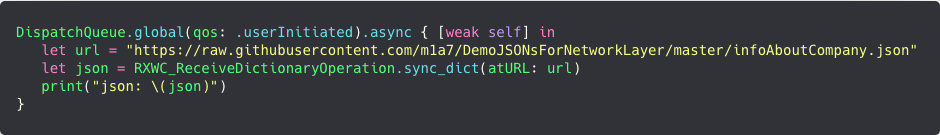

- Асинхронный метод кэширования `json` файла.

[Copy code](Documentation/TextSnippet/async_dictAtURL.txt) <br>
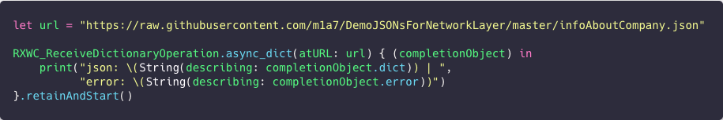

<br>**RXWC_ReceiveDictionaryOperation** имеет схожие ограничения с **RXWC_ReceiveImageOperation**.

| **Особенности взаимодействия с RXWC_ReceiveDictionaryOperation**                                                                                                                              |
| --------------------------------------------------------------------------------------------------------------------------------------------------------------------------------------------- |
| **1)** Если вы передадите `nil` в `expireDate:(NSDate*)expireDate` или в `expireTimeStamp:(NSString*) expireTimeStamp` тогда скаченный элемент не будет  сохранен в БД.                       |
| **2)** Если метод не имеет параметра для срока хранения элемента в кэше, то это означает что значение будет взято из `RXWebCache.defaultTimeTermForStoreItemInCache`.                         |
| **3)** Если вы не передадите маску `RXWC_RIO_Options` в соответствующий параметр, то внутри метода значение будет заимствовано из проперти класса `RXWC_ReceiveItemOperation.defaultOptions`. |

---

<br>

## 💾 Кэширование любых данных с помощью RXWC_RecievieItemOperation

Как уже было написано выше фраемворк `RXWebCache` предоставляет различные классы наследники `NSOperation`, которые работают по тому же принципу что и **RXWC_RecievieItemOperation** только конвертируют полученный бинарный код в экземпляры разных классов,  **RXWC_ReceiveImageOperation** - `UIImage`, **RXWC_ReceiveDictionaryOperation** - `NSDictionary`. <br>
По сути они являются классами обертками над **RXWC_RecievieItemOperation**.

Поскольку невозможно написать классы обертки на каждый случай, для этого существует базовый класс **RXWC_RecievieItemOperation**, который кэширует бинарный код и возвращает пользователю за кэшированные данные в формате `NSData`.

Класс работает по следующему принципу:

1) Выполняет поиск по `url`+`params` в локальных хранилищах (RAM и диск). И возвращает если находит. Или удаляет если срок хранения истек.

2) Начинает процедуру скачивания  элемента и последующую процедуру записи на диск.

Также **RXWC_RecievieItemOperation** - поддерживает синхронный и асинхронный режим кэширования.

В демонстрационных примерах которые расположены ниже мы рассмотрим каждый из возможных кейсов кэширования.

Часто может возникнуть ситуация когда Вам потребуется скачать текстовый файл.<br>В данном примере мы делаем это с помощью синхронного метода.

[Copy code](Documentation/TextSnippet/sync_itemAtURL.txt)<br>
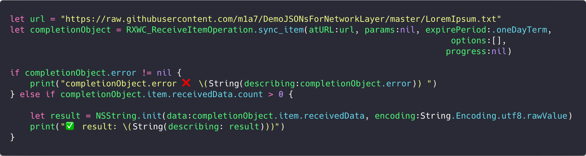

Тут мы синхронно скачиваем и кэшируем  картинку.<br>⚠️ Обратите внимание на одну очень важную вещь. <br>Когда вы вызываете синхронный метод то он блокирует поток с которого был вызван.<br>Соответственно Вы можете попасть в ситуацию, когда вы вызываете метод на главном потоке, а progressBlock не работает.<br>
Такой эффект может возникнуть потому что по умолчанию `progressBlock` вызывается на главном потоке, а как он может вызваться если поток заблокирован до того момента пока картинка не будет полностью скачена и за кэширована.

**Поэтому в данной ситуации есть два выхода:**

1) Вызывать синхронный метод на фоновом потоке.

2) Или вызывать на главном, но одновременно передавать флаг `RXWC_RIO_Option_CallProgressBlockOnBackground`.

[Copy code](Documentation/TextSnippet/sync_itemAtURL-image.txt)<br>
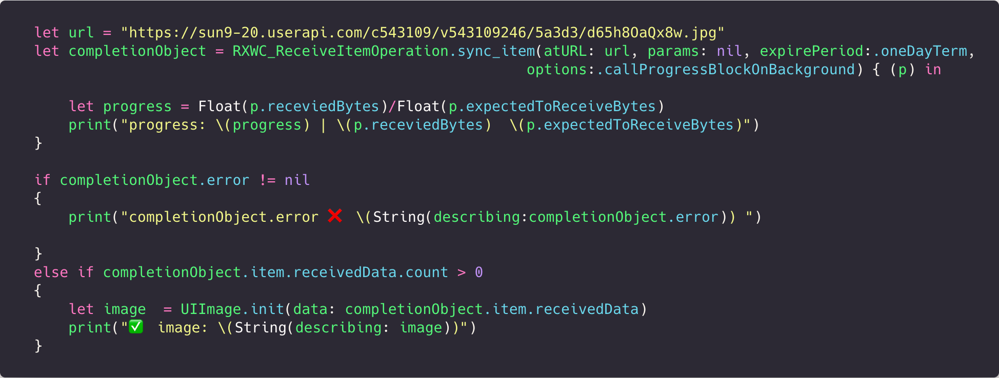

<br>

Пример работы с асинхронным методом класса.

[Copy code](Documentation/TextSnippet/initWithURL-json.txt)<br>
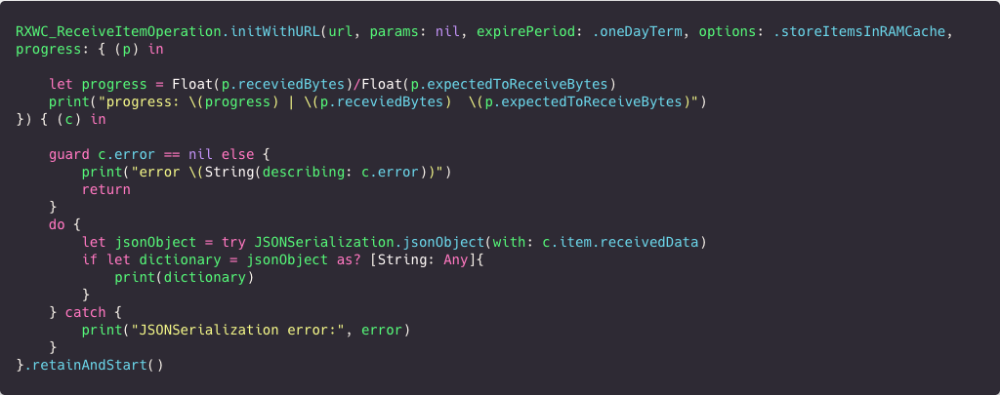

---

<br>

## 🚀 RXWebCache

Главный класс фраемворка. Реализует методы взаимодействия с БД (`добавления`/`удаления`/`извлечение` и тд.)

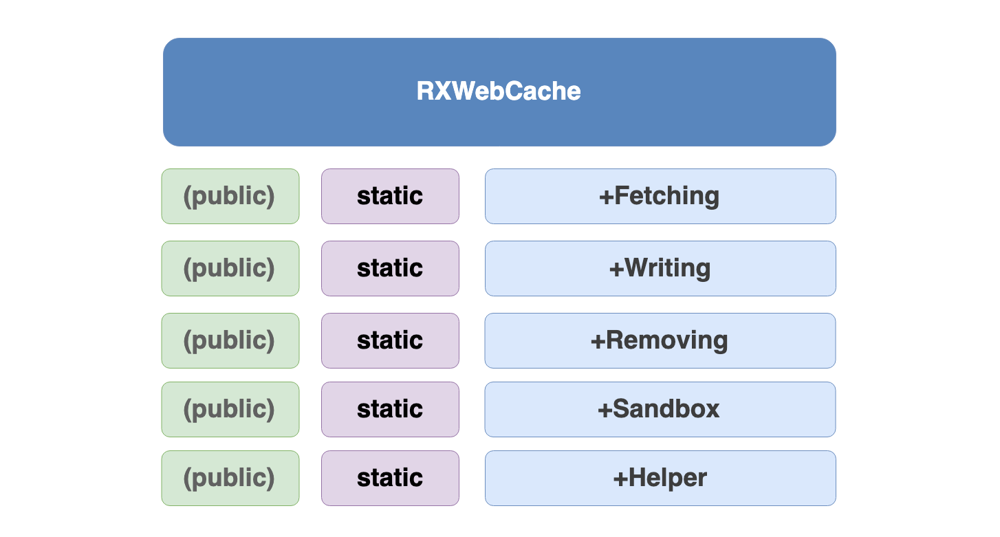

### Обзор главных проперти класса

В файле `RXWebCache.h` представлены проперти которые конфигурируют работу всего фраемворка.

Например установив нужный флаг в `RXWebCache.options` Вы можете включить логирование.

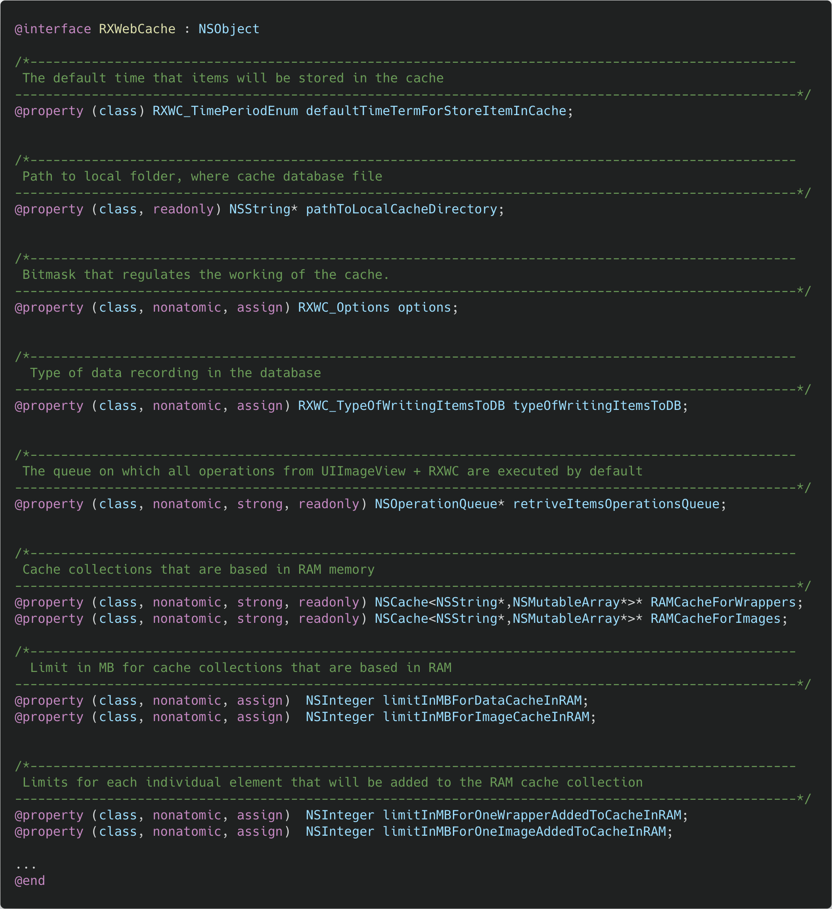

Также `RXWebCache.h`  содержит методы добавления моделей и изображений в кэш-коллекции которые базируются в БД.<br>Метод отчистки кэшей и метод предоставляющий информацию о фраемворке.

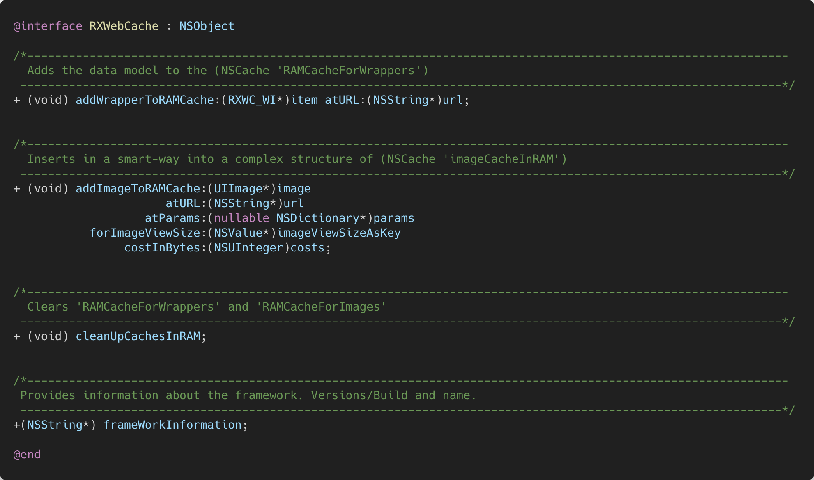

---

### Обзор writing методов

Категория предоставляет два метода которые конвертируют и записывают объекты обертки `RXWC_WrapperItem` в `RXWC_Item`.

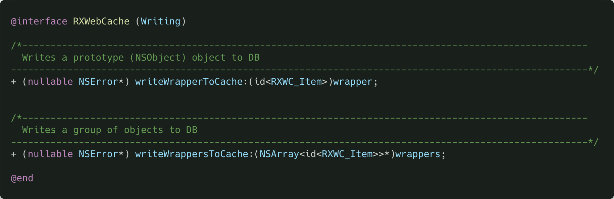

### Пример:

Кстати если вы хотите за кэшировать некий объект который был создан локально на устройстве (например некий рисунок), то вы можете создать объект `RXWC_WrapperItem` конвертировать рисунок в формат `NSData`, вставить в проперти `receivedData`, затем придумать название константы и сохранить объект с помощью одного из двух методов категории.

[Copy code](Documentation/TextSnippet/RXWebCache-Writing-Example1.txt)<br>
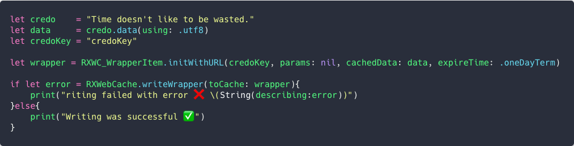

---

### Обзор Fetching методов

В данной категории представлены методы класса которые позволят вам как извлекать отдельные элементы из кэша, так и получать общею информацию, например суммарное количество объектов в БД.

Главным образом элемент ищется по той информации из какого источник он был получен (`url`+`params` ).<br>Также можно вытаскивать элемент по индексу (т.е. порядковому номеру).

Обращу Ваше внимание на то, что с помощью класса **RXWC_ItemCollection** Вы можете составлять очень гибкие поисковые выборки используя `NSPredicate` / `KVC` / `NSSortDescriptor` и другие технологии.

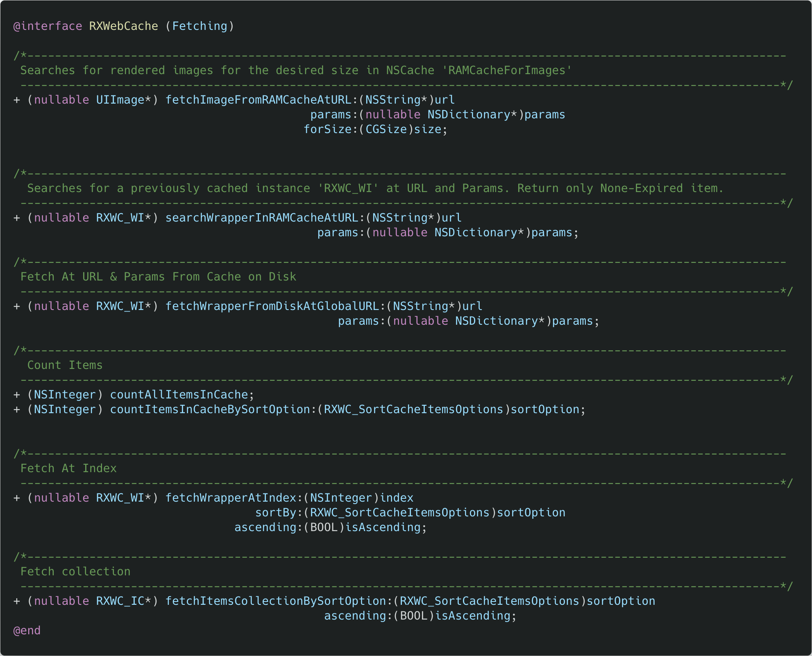

### Пример

В данном примере используется метод `fetchWrapperFromDiskAtGlobalURL:params`, который извлекает объект с жесткого диска устройства.

[Copy code](Documentation/TextSnippet/RXWebCache-Fetching-Example1.txt)<br>
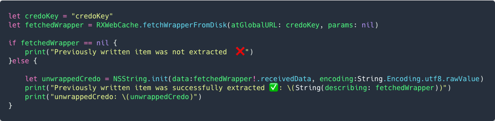

---

### Обзор Removing методов

Ниже вашему вниманию представлены методы удаления объектов из БД.<br>Также возможность самостоятельно удалиться из базы данных может некоторые объекты `RXWC_WrapperItem`(которые были получены из методов категории `RXWebCache+Fetching`) и коллекции `RXWC_ItemCollection`, для этого они имеют собственные вспомогательные методы `-isCanBeDirectlyRemovedFromDB` и `-directlyRemoveWrapperFromDB`.

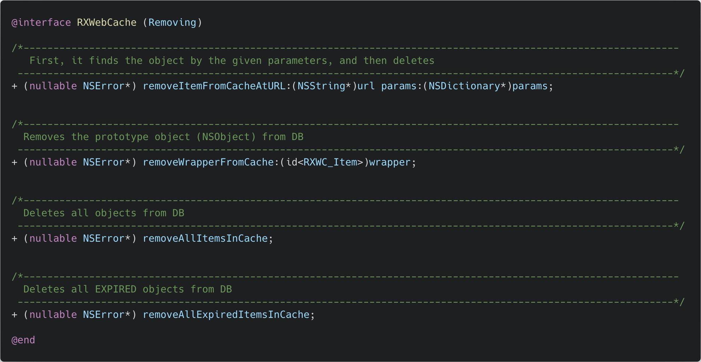

### Примеры:

В данном случае метод `+removeItemFromCacheAtURL:params:` сам ищет нужный экземпляр в БД, и если находит то, совершает процедуру удаления.

[Copy code](Documentation/TextSnippet/RXWebCache-Removing-Example1.txt)<br>
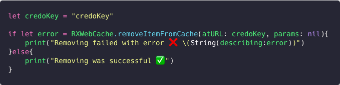

А тут мы передаем в метод конкретный объект который будет удален.
[Copy code](Documentation/TextSnippet/RXWebCache-Removing-Example2.txt)<br>
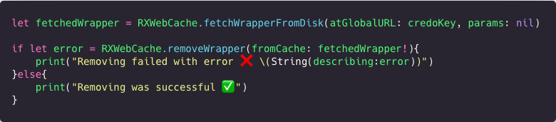

---

### Обзор Sandbox методов

В категории **Sandbox** вы получаете доступ к методам которые могут вернуть путь до директории в которой располагаются за кэшированные файлы базы данных, а также физический стереть данную директорию.

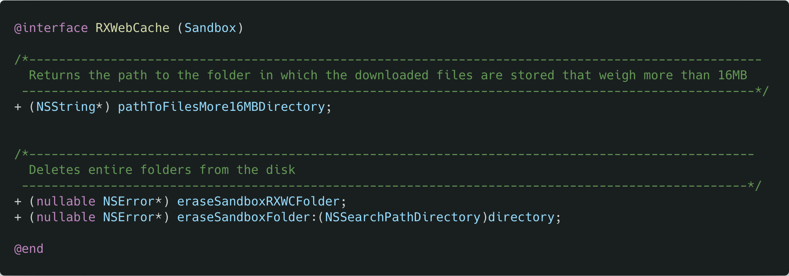

---

### Обзор Helper методов

Поскольку фраемворк **RXWebCache** имеет очень обширный функционал, то чтобы пользователи могли эффективно использовать библиотеку, была создана категория `Helper`, которая содержит разные методы полезные во время дебагинга кода.

К слову многие статические методы `RXWebCache` в качестве возвращаемого типа возвращают экземпляр `NSError`, которые содержат внутренний словарь с подробным описанием возникшей проблемы и возможным способом ее решения.

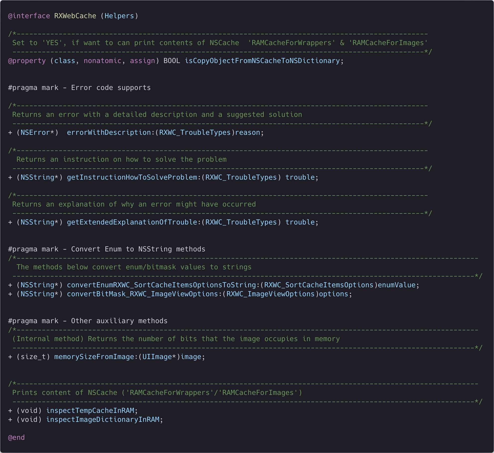  

### Пример:

В этом примере разбирается случай, где применяется метод `+memorySizeFromImage:`. <br>Архитектура фраемворка позволяет пользователю самостоятельно добавлять картинки в `NSCache RAMCacheForImages`, но поскольку библиотека берет на себя обязательство отчищать кэш если лимит хранимых данных будет превышен, то вы обязательно должны передавать в метод `cost` картинки, то есть информацию сколько место в битах она занимает.

[Copy code](Documentation/TextSnippet/addImageToRAMCache.txt)<br>
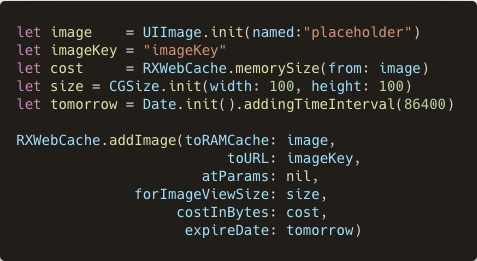

---

<br>

## 🗄 RXWC_ItemCollection

Класс **RXWC_ItemCollection** является потоко-безопастной оберткой над классом `RMLResult` (технологии `Realm`).<br>
Главная задача класса состоит в том, чтобы извлечь из БД группу объектов объединенных между собой по одной или более детали (например по `дате создания`, `url`, и прочим).

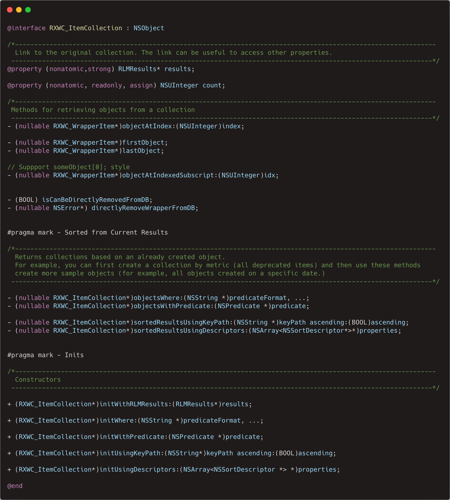

Поскольку класс является всего лишь потокобезопастной оберткой, то компоновка поискового запроса осуществляется на тех правилах, которые устанавливает технология `Realm`. <br>
Для этого рекомендуем вам прочитать соответствующую главу  [Queries](https://realm.io/docs/objc/latest/#queries) их документации. И [подсказку NSPredicate](https://academy.realm.io/posts/nspredicate-cheatsheet/).

### Примеры:

**+initWhere:**

**+initWhere:**

```swift
let collection = RXWC_ItemCollection.initWhere("url == '\(url)'")
let collection = RXWC_ItemCollection.initWhere("url BEGINSWITH 'pp.userapi.com'")
let collection = RXWC_ItemCollection.initWhere("url ENDSWITH   '.jpg'")
let collection = RXWC_ItemCollection.initWhere("url  CONTAINS  'sun6-2.userapi.com'")
```

**+initWithPredicate:**

```swift
let validItemsPredicate   = NSPredicate(format: "expireStoredItemInCacheDate > %@", NSDate.init())
let expiredItemsPredicate = NSPredicate(format: "expireStoredItemInCacheDate <= %@", NSDate.init())

let validCollection   = RXWC_ItemCollection.initWith(validItemsPredicate)
let expiredCollection = RXWC_ItemCollection.initWith(expiredItemsPredicate)

let specifedURLAndValidItemsPredicate = NSPredicate(format:"url == %@ AND expireStoredItemInCacheDate > %@",url, NSDate.init())
let collection = RXWC_ItemCollection.initWith(specifedURLAndValidItemsPredicate)
```

**+initUsingKeyPath:ascending:**

```swift
let collection = RXWC_ItemCollection.initUsingKeyPath("addedItemInCacheDate", ascending: true)
```

**+initUsingDescriptors:**

```swift
let sortDescriptor = NSSortDescriptor.init(key:"addedItemInCacheDate", ascending: false)
let collection = RXWC_ItemCollection.initUsing([sortDescriptor])
```

<br>

### 🗂 Как устроена структура файлов и папок в песочнице

Папка где базируются файлы базы данных находиться по адресу: `~Library/Caches/RXWebCache`.

Так как фраемворк **RXWebCache** в качестве базы данных использует технологию `Realm` (в которой есть ограничение на хранение данных внутри файла `.realm` не привышающих **16МБ**), то внутри папки `RXWebCache` существует подпапка `FileMore16MB` которая хранит большие файлы.

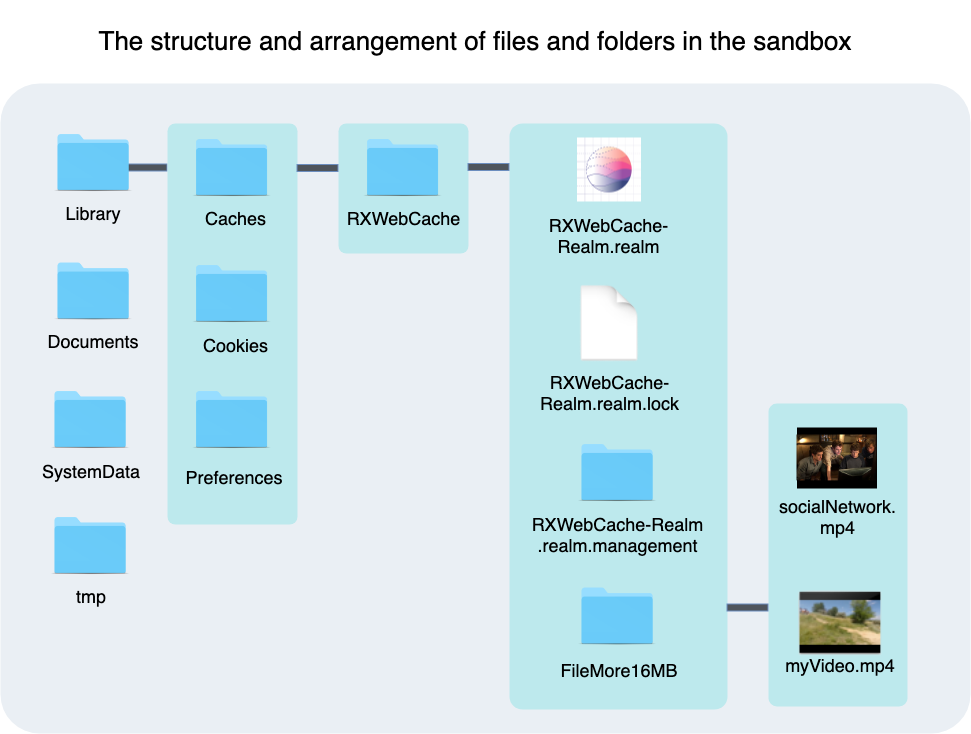

Если вы тестируете работу фраемворка на симуляторе, то вы имеете возможность отслеживать изменения в реальном времени, просто открыв нужную директорию.

Чтобы  узнать путь до песочницы вашего приложения, поместить этот код в метод `-didFinishLaunchingWithOptions`.

```swift
 print("NSHomeDirectory() \(NSHomeDirectory())")
```

После откройте терминал, напишите команду `open`, поставьте пробел и вставьте путь из консоли.

```bash
open data/Cotainers/Application/197467127COD3-4A89-AE84-AG11-8FF39C68EDOB
```

---

Также если вы хотите вручную манипулировать данными в файле `.realm`, рекомендуем Вам скачать [Realm Studio](https://realm.io/products/realm-studio/).

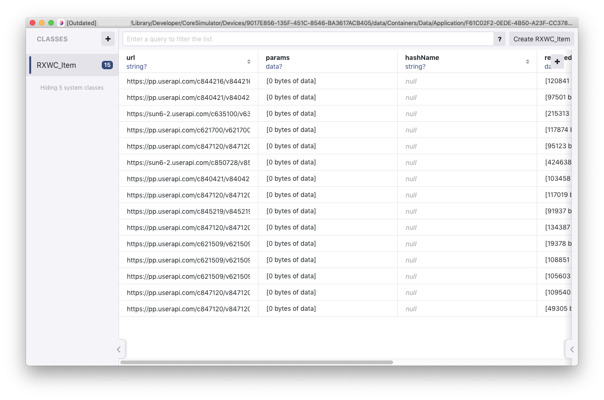

## 🏎 Технологии которые используются внутри RXWebCache

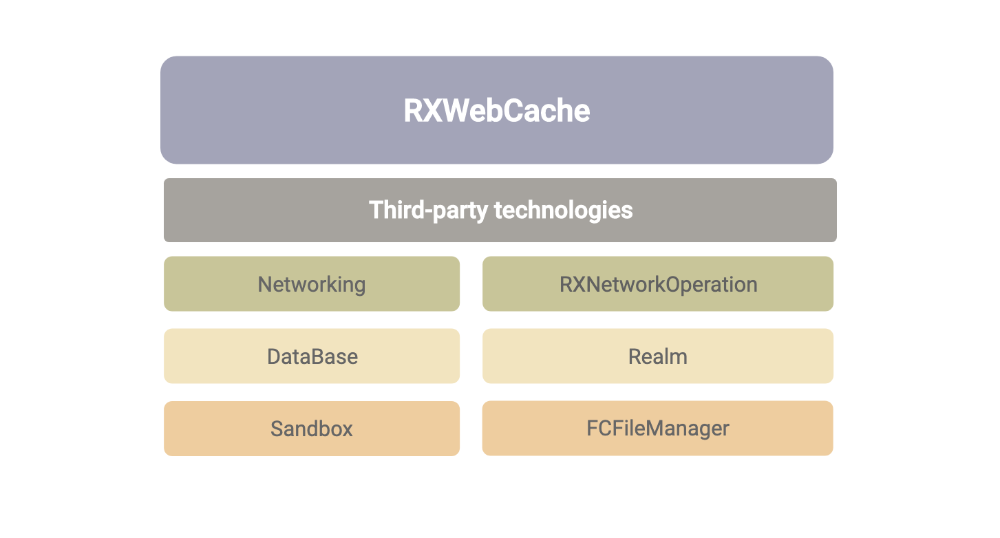

**RXNetworkOperation**  - отвечает за соединение с сетью.<br>
**Realm**               - отвечает за базу данных.<br>
**FCFileManager**       - отвечает за взаимодействие с песочницей приложения.<br>

<br>

## 🍫 Рекомендации

В случае если приложение будет занимать большое (в процентном соотношении для каждого устройства) место в оперативной памяти, и система вызовет метод `-applicationDidReceiveMemoryWarning:`, рекомендуется вызвать метод `+cleanUpCachesInRAM` который отчистит коллекции `NSCache`.

```swift
func applicationDidReceiveMemoryWarning(_ application: UIApplication) {
    RXWebCache.cleanUpCachesInRAM()
}
```

---

Чтобы своевременно удалять истекшие объекты, рекомендуется вызывать метод `+removeAllExpiredItemsInCache:` 
в `-didFinishLaunchingWithOptions:` .

Данный метод можно вызывать в  любой момент когда вам требуется очистить дисковое пространство, а также место в оперативной памяти.

```swift
func application(_ application: UIApplication, didFinishLaunchingWithOptions launchOptions: [UIApplication.LaunchOptionsKey: Any]?) -> Bool {       

  RXWebCache.removeAllExpiredItems(inCache:[])
}
```

---

Также можно посоветовать ответственно подходить к настройке политики кэширования изображений.<br>

Например от рисовывать картинку в оригинальную величину рекомендуется только исключительных случаях (когда есть вероятность что пользователь может воспользоваться `zoom in` жестом). <br>Во всех табличных представлениях (`UITableView`/`UICollectionView`) настоятельно советуем кэшировать изображение вместе с флагом `RXWC_ImageViewOptions_ResizeImageIfItGreaterThenView`.

---

Немаловажным фактором влияющим на эффективность работы библиотеки является политика записи элементов в БД.

Если ваше приложение не требует сто процентного и моментального кэширования данных на диск, то рекомендуется включить групповую запись в методе `-didFinishLaunchingWithOptions`.

```swift
RXWebCache.typeOfWritingItemsToDB = .groupWritingByCountLimit;
RXWC_StorageForGroupWrappersWriting.numberOfAddedWrappersAfterWhichTheyWillBeWrittenToDB = 40
```

Это позволит системе не тратить дополнительные ресурсы при записи на диск.

Дело в том, что внутренние устройство технологии `Realm` является таковым что "**открыть ворота**" в хранилище для  записи группы объектов является менее затратным, чем тратить время на "**открытие ворот**" и синхронизацию данных между менеджерами БД на разных потоках для каждого объекта по отдельности.

---

<br>

## 🎖 Тесты производительности

Ниже вашему вниманию представлены графики тестов. Для сравнения тестируются две технологии `RXWebCache` и `SDWebImage`.

Тестирование происходит в трех этапах:

1. **Первичное скачивание**. (На этом этапе картинка впервые скачивается и кэшируется в RAM и на диск).

2. **Извлечение из RAM**. (Ранее от рисованная картинка будет запрошена из коллекции `NSCache`).

3. **Восстановление с диска**. (Картинку инициализируют из бинарного кода который извлекается с диска устройства).

Производительность измеряется в количестве времени (`в секундах`) которое было затраченное на получение, запись и отрисовку изображения. 

<p align="center">
  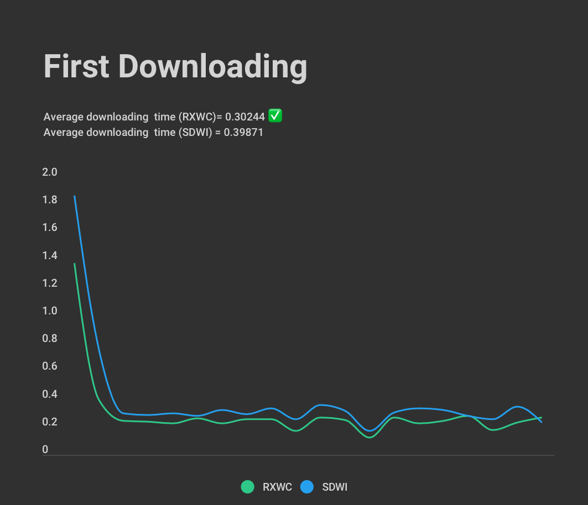
</p>

<p align="center">
  
</p>

<p align="center">
  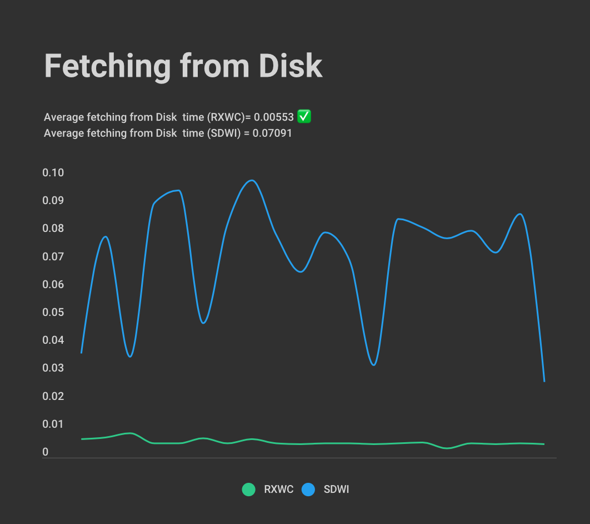
</p>

На этой таблице вы можете увидеть на основании каких значений были построены графики.

Находя среднее значение из всех режимов тестирования, получается что **RXWebCache** `работает быстрее чем` **SDWebImage** <u>в ~1.5 раза</u>.

**Важно сказать что первая стадия тестирования (то есть скачивание) является достаточно непредсказуемым из-за постоянно меняющейся скорости интернета. 
Поэтому результаты тестирования могут незначительно отличаться друг от друга.*

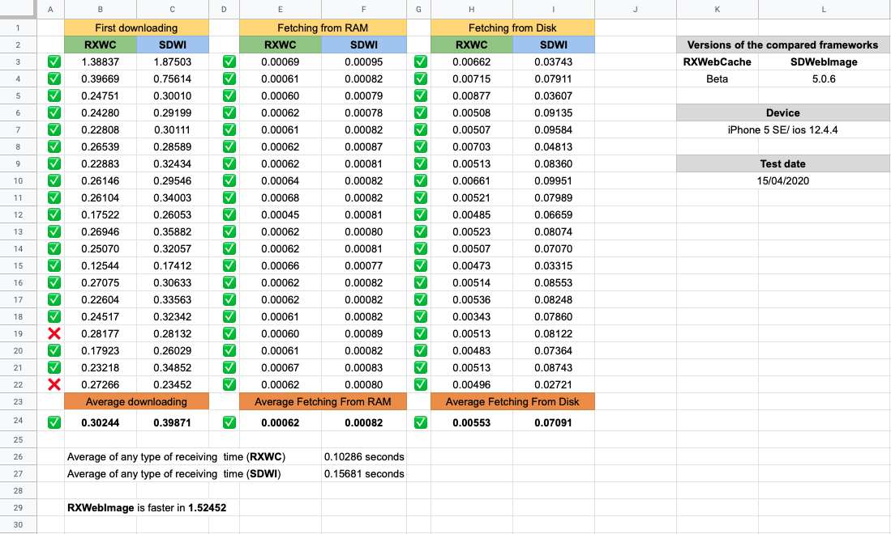


<br>

## 📲 Совместимость

Фраемворк был написан на языке `Objective-c`, что позволяет технологии быть совместимой с как с `ObjC` проектами, так и со `Swift`.

| Objective-c Projects | Swift Projects | Minimum ios version |
|:--------------------:| -------------- |:-------------------:|
| ✅                    | ✅              | `ios 8+`            |

Для работы в Swift проекте была создана специальная версия фраемворка `RXWebCacheSwiftSDK`.

<br>

## 🎯 Как подключить фраемворк к проекту

**Шаг 1**

Создайте папку `Frameworks` в папке вашего проекта и скопируйте в нее файл `RXWebCacheSwiftSDK.framework`, а также другие фраемворки которые используются внутри `RXWebCache`. 
Перетащите `RXNetworkOperation.framework` и `Realm.framework`.

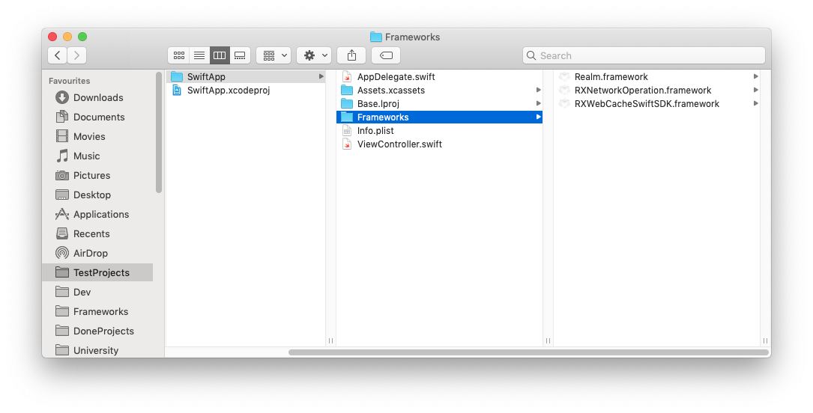

**Шаг 2**
Перетащите папку с вложенным фреймворком в структуру проекта.

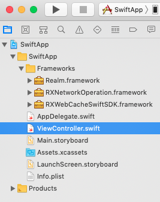

**Шаг 3**

На вкладке **General** добавьте `RXWebCacheSDK.framework`,`Realm.framework`,`RXNetworkOperation.framework` в секцию **Embedded Binaries** и **Linked Frameworks and Libraries**.

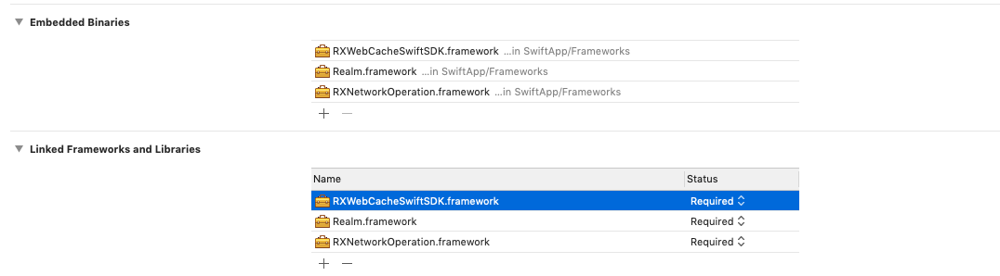

<br>

**Шаг 4**

Создайте `Objective-c` файл в своем проекте (если он еще не был создан).

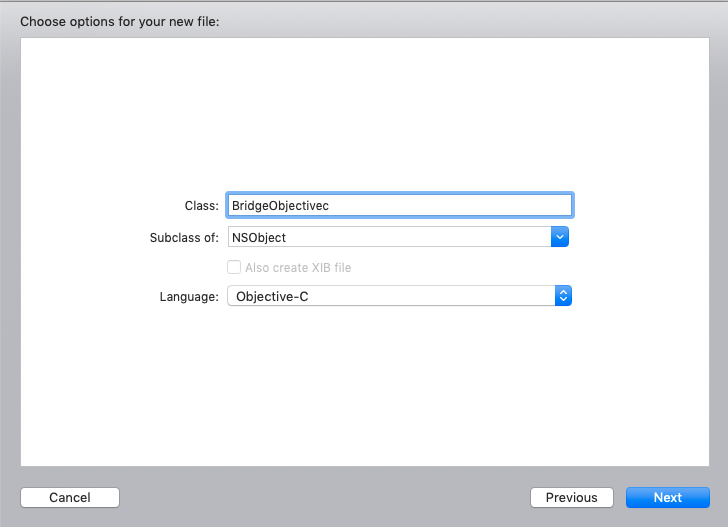

Далее **Xcode** автоматический предложит вам создать "**bridging header**" (если он уже не был создан вами ранее).
Нажмите **Create Bridging Header**.

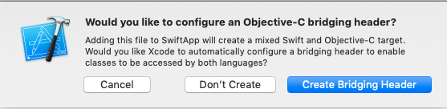

<br>

**Шаг 5**

Импортируете в него названия **Objective-c** классов и фраемворков, которые вы хотите использовать в основном **Swift** проекте.

```objectivec
#import <RXWebCacheSwiftSDK/RXWebCacheSwiftSDK.h>
#import <Realm/Realm.h>
#import <RXNetworkOperation/RXNetworkOperation.h>
```

<br>

**Шаг 6**

Добавьте `UIImageView` в вашем `Storyboard`, чтобы протестировать работоспособность библиотеки.

```swift
import UIKit
import RXWebCacheSwiftSDK

class ViewController: UIViewController {

    @IBOutlet weak var imageView: UIImageView!

    override func viewDidLoad() {
        super.viewDidLoad()
          let url = "https://sun9-20.userapi.com/c543109/v543109246/5a3d3/d65h8OaQx8w.jpg"
          imageView.imgURL(url, options: .byImageIO)
    }
}
```


## 📜 История создания

 Автор, как и большинство  **iOS** разработчиков использовал библиотеку `SDWebImage` для кэширования изображений.

Но в процессе разработки приложений у меня появилась потребность кэшировать не только фотографии, но, и еще контролировать срок хранения каждого отдельного элемента в кэше.

И со временем появилось желание сделать процесс установки срока хранения и удаления истекших элементов - комфортным для разработчика.

Так и появился фраемворк `RXWebCache` (`RXWC`).

 За время разработки - `RXWC` сильно вырос и развился от первоначальной идеи (кэшировать изображения) до технологии которая позволяет кэшировать любые данные и осуществлять этот процесс крайне гибко - предоставляя пользователю всю широту настроек.

На данный момент фраемворк имеет несколько дополнительных подклассов и категорий которые не только кэшируют данные, а сразу же обрабатывают и конвертируют их например в экземпляр `NSDicitonary` или `UIImage`.

<br>

## 🛣 Перспективы использования

Большинство `iOS` приложений можно охарактеризовать как "`клиент-серверные`", что означает, что большинству приложений жизненно необходимо совершать сетевые запросы (и возможно кэшировать ответы сервера). 

Возможности которые предоставляет фраемворк - позволяют сказать, что `RXWebCache` может стать полноценной заменой собственного сетевого слоя  в маленьких приложениях. 

Так как библиотека выполняет сразу несколько функциональных нагрузок:

1. Скачивает данные из интернета.
2. Записывает полученную информацию в базу данных.
3. Обрабатывает и конвертирует бинарный код в экземпляр нужного вам класса.

Также библиотека может быть эффективной тогда, когда вам нужно быстро разработать и внедрить новую фичу в существующее приложение, в котором  добавление новых методов (выполняющих функцию общения с `API`) в архитектуру сетевого слоя - является трудозатратной.  

<br>

## 🗿 Философия архитектуры фраемворка

Философия фраемворка базируется на жизненном кредо **Генри** **Форда**.


Поэтому фраемоврк строился таким образом, чтобы пользователю не нужно было держать в памяти приложения ссылки на объекты менеджеры, думать об абстракции  которая бы позволяла иметь доступ к библиотеке из разных точек приложения.

Именно по этому `RXWebCache` предоставляет много статических функций (то есть методов класса), которые могут выполнять широкий спектр задач, не требуя от пользователя создания и удержания объектов библиотеки в памяти.

 Большинство задач фраемворк позволяет решить двумя подходами:

1. Процесс которые были инициированы статическими методами      - **не** могут быть отменны.
2. Процесс которые были инициированы от имени объектов-операций - **могут** быть прерваны.

То есть например если перед вами стоит задача извлечь данные из кэша, вы можете это сделать не создавая ни одного объекта с помощью класса `RXWebCache`. (Но тогда процесс извлечения не может быть прерван), или осуществить это с помощью экземпляра класса `RXWC_RecievieItemOperation` - который позволяет вам полностью контролировать любой процесс.

<br>

## 🧬 Кредо фраемворка

> "Оставьте заботу о кэшировании данных нам, а сами сконцентрируйтесь на первоначальном замысле".

## 

## Расшифровка кредо

Не тратьте каждый раз время на постройку абстракции которая будут получать и кэшировать данные.
Предоставьте эту работу нам, а сами сфокусируйтесь на разработке такой функциональности, от которой пользователи раз за разом будут возвращаться в ваше приложение!

<br>

## 🗃 Предназначение каждого класса

     Ниже вы можете увидеть краткие описания для каждого класса.
     

#### Главный класс

| 🚀 RXWebCache                                                                                                                                                                                                 |
|:------------------------------------------------------------------------------------------------------------------------------------------------------------------------------------------------------------- |
| Класс `RXWebCache` и его категории реализуют статические методы взаимодействия с БД (`добавления`/`удаления`/`извлечение` и тд.)<br>Для этого вам не потребуется создание дополнительных объектов менеджеров. |

<br>

#### **Операции (наследники NSOperation)**

|      | Название                            | Описание                                                                                                                                                                                                                                                                                                                                                                                                                                                                                                                                                                                                                         |
| ---- | ----------------------------------- | -------------------------------------------------------------------------------------------------------------------------------------------------------------------------------------------------------------------------------------------------------------------------------------------------------------------------------------------------------------------------------------------------------------------------------------------------------------------------------------------------------------------------------------------------------------------------------------------------------------------------------- |
| 🔮   | **RXWC_RecievieItemOperation**      | Класс `RXWC_RecievieItemOperation` (сокр.,`RXWC_RIO`) (и классы наследники), которые предоставляют пользователю только конструкторы, в которые разработчик должен передать информацию (**url**+**params** итд) с какого ресурса он хочет получить данные.<br>Во время исполнения операции алгоритм проверит наличие запрашиваемого элемента в локальном кэше.<br>Если будет найден элемент с валидным сроком годности, то вернет пользователю.<br>Если у элемента будет истекший срок годности, то удалит его и начнет операцию скачивания.<br>Далее если это требуется то элемент, будет записан в БД и возвращен пользователю. |
| 🔮🏞 | **RXWC_ReceiveImageOperation**      | Класс занимается кэшированием изображений. Пользователю возвращает экземпляр `UIImage`.<br>Также предоставляются гибкие параметры в отношении политики кэшировании и кастомизации процесс отрисовки изображения.                                                                                                                                                                                                                                                                                                                                                                                                                 |
| 🔮📖 | **RXWC_ReceiveDictionaryOperation** | Класс занимается кэшированием `json` файлов. Пользователю возвращает экземпляр `NSDicitonary`.                                                                                                                                                                                                                                                                                                                                                                                                                                                                                                                                   |

<br>

#### **Публичные категории**

| 🏞 UIImageView+RXWC                                                                                                                                                                                                                                                                                                                                                                                                                                                                                                                                                             |
|:------------------------------------------------------------------------------------------------------------------------------------------------------------------------------------------------------------------------------------------------------------------------------------------------------------------------------------------------------------------------------------------------------------------------------------------------------------------------------------------------------------------------------------------------------------------------------- |
| Фраемворк предоставляет пользователю на выбор два подхода к кэшированию изображений.                                                                                                                                                                                                                                                                                                                                                                                                                                                                                            |
| Кэшировать картинку с помощью наследника класса `NSOperation`.<br>При таком подходе вам нужно будет каждый раз инициализировать операцию, запускать вручную или ставить в очередь.<br>А после удачной процедуры скачивания вставлять экземпляр `UIImage` в `UIImageView`.<br>Один из плюсов такого подхода состоит в том, что класс `RXWC_ReceiveImageOperation` поддерживает синхронный режим кэширования.<br>То есть это может позволить вам избежать `callback-hell` в ситуациях когда вам нужно дождаться загрузки всех компонентов. И всех вместе их отобразить на экране. |
| Кэшировать картинку с помощью категории **UIImageView+RXWC**.<br>Что воспользоваться этим подходом, вам требуется иметь экземпляр `UIImageView` от имени которого будет вызван метод кэширования.<br>Плюс этого подход заключается в простоте использования. Вам нужно иметь только экземпляр `UIImageView`, всю остальную работу выполнит фраемворк.                                                                                                                                                                                                                           |

<br>

#### **Модели**

|         | Название             | Описание                                                                                                                                                                                                                                                                                                                                                                                                                                                                                           |
| ------- | -------------------- | -------------------------------------------------------------------------------------------------------------------------------------------------------------------------------------------------------------------------------------------------------------------------------------------------------------------------------------------------------------------------------------------------------------------------------------------------------------------------------------------------- |
| 📋      | **RXWC_Item**        | Класс описывающий модель ответа на сетевой запрос. Хранит все параметры совершенного сетевого запроса и полученный в ответ бинарный код (в формате NSData).<br>Поскольку класс является наследником "RLMObject" (библиотеки Realm) - то экземпляры класса имеют жесткие ограничения и являются потоко-небезопасными.<br>Класс используется только внутри самой библиотеки. Вам как стороннему пользователю рекомендуется взаимодействовать с RXWC_WrapperItem по причине его потоко-безопастности. |
| 📑      | **RXWC_WrapperItem** | Класс "обертка" над RXWC_Item. (являются наследником NSObject). Дублирует все методы и проперти оригинальной модели и являются потокобезопасным.<br>При работе с библиотекой в качестве класса описывающего модель, рекомендуется использовать исключительно RXWC_WrapperItem.                                                                                                                                                                                                                     |
| 🤹🏻‍♂️ | **RXWC_HelperItem**  | Класс содержит статические методы помощники вынесенные из RXWC_Item и RXWC_WrapperItem.                                                                                                                                                                                                                                                                                                                                                                                                            |

<br>

#### **Коллекции**

| 🗄 RXWC_ItemCollection                                                                                                                                                                                                                                                                      |
|:------------------------------------------------------------------------------------------------------------------------------------------------------------------------------------------------------------------------------------------------------------------------------------------- |
| Используется в качестве коллекции которая хранит элементы, и самостоятельно осуществляет поиск в БД по переданному в конструктор ориентиру поиска (например `NSPredicate`).<br>Класс наследник `NSObject`. Является потокобезопасной оберткой над классом `RLMResult` (библиотеки `Realm`). |

<br>

#### **Групповая запись**

| 🖌 🗂 RXWC_StorageForGroupWrappersWriting                                                                                                                                                                                                                                                                                                                                                   |
|:------------------------------------------------------------------------------------------------------------------------------------------------------------------------------------------------------------------------------------------------------------------------------------------------------------------------------------------------------------------------------------------- |
| Фраемворк `RXWebCache` является высоко оптимизированным. Поэтому предоставляет пользователю несколько вариантов записи скаченных элементов в базу данных.                                                                                                                                                                                                                                   |
| 1. (**По умолчанию**) использует режим незамедлительной одиночной записи.<br>То есть как только элемент был скачен, сразу же был записан в БД.<br>Такой подход является достаточно ресурса затратным потому что каждый раз для записи одного объекта приходится открывать и закрывать ворота в хранилище.<br>В библиотеки `Relam` гораздо эффективней записывать объекты большими группами. |
| 2. Запись группы объектов (из временного хранилища в RAM) через каждые N секунд в базу данных на диске.                                                                                                                                                                                                                                                                                     |
| 3. Запись группы объектов по достижению необходимого количественного минимума.<br>То есть как только временное хранилище в RAM будет иметь N количество хранящихся в нем элементов, то сразу же будет произведена запись в БД.<br>Класс **RXWC_StorageForGroupWrappersWriting** содержит временное хранилище элементов и реализует в себе механизмы групповой записи объектов в БД.         |

<br>

#### Тесты

|      | Название                          | Описание                                                                                                                                                                                                                                                                                                     |
| ---- | --------------------------------- | ------------------------------------------------------------------------------------------------------------------------------------------------------------------------------------------------------------------------------------------------------------------------------------------------------------ |
| ⚙️   | RXWC_DiagnosticRAMCache           | Фраеморк поддерживает режим двойного кэширования на диск и RAM. В RAM кэш располагается в коллекции `NSCache`.<br><br>Архитектура библиотеки `Foundation` не позволяет распечатывать содержимое `NSCache`.<br>Поэтому был создан менеджер диагностики, который позволяет распечатывать содержимое `NSCache`. |
| 🤖🏞 | RXWC_UIImageView_UnitTest         | Тестирует работоспособность категории `UIImageView+RXWC`.                                                                                                                                                                                                                                                    |
| 🤖🔮 | RXWC_ReceiveItemOperationUnitTest | Тестирует работоспособность класса `RXWC_ReceiveItemOperation+RXWC`.                                                                                                                                                                                                                                         |
| 🤖🚀 | RXWebCacheUnitTes                 | Тестирует весь `API` предоставляемый классом `RXWebCache`.                                                                                                                                                                                                                                                   |

<br>

## Автор

[👨🏼‍💻 @m1a7](github.com/m1a7)  <br>
👌🏻 thisismymail03@gmail.com

💼 **RXWebCache** - является приватной технологией с закрытым исходным кодом.

<br>

## Дополнительно

[🇬🇧 English Readme]()

[Здесь вы можете более подробно узнать о различиях между технологиями отрисовки изображений](https://github.com/m1a7/ResizeImageApp2)
