# Table of contents

- [💎Definition](#-definition)
- [💡The concept of the framework](#-the-concept-of-the-framework)
- [🏞 Image caching](#-image-caching)
  - [General settings for each caching approach](#%EF%B8%8F-general-settings-for-each-caching-approach)
  - [Bit mask RXWC_ImageViewOptions](#0%EF%B8%8F⃣-1%EF%B8%8F⃣-bit-mask-rxwc_imageviewoptions)
  - [The duality of values in the bitmask](#%EF%B8%8F-the-duality-of-values-in-the-bitmask)
  - [Expiration date of items in the cache](#-expiration-date-of-items-in-the-cache)
  - [Properties of the RXWebCache class related to image caching](#--Properties-of-the-RXWebCache-class-related-to-image-caching)
  - [Caching images using the UIImageView+RXWC category](#caching-images-using-the-uiimageviewrxwc-category)
  - [Caching of images using RXWC_ReceiveImageOperation](#caching-images-using-rxwc_receiveimageoperation)
- [📖Caching json files using RXWC_ReceiveDictionaryOperation](#-Caching-json-files-using-RXWC_ReceiveDictionaryOperation)
- [💾Caching any data using RXWC_RecievieItemOperation](#-Caching-any-data-using-RXWC_RecievieItemOperation)
- [🚀RXWebCache](#-RXWebCache)
  - [Overview of Writing  methods](#overview-of-writing--methods)
  - [Overview of Fetching methods](#overview-of-Fetching-methods)
  - [Overview of Removing methods](#overview-of-Removing-methods)
  - [Overview of Sandbox  methods](#overview-of-Sandbox-methods)
  - [Overview of Helper   methods](#overview-of-helper---methods)
- [🗄RXWC_ItemCollection](#-RXWC_ItemCollection)
- [🗂How files and folders are structured in the sandbox](#-How-files-and-folders-are-structured-in-the-sandbox)
- [🍫Recommendations](#-Recommendations)
- [🎖Performance test](#-Performance-test)
- [📲 Compatibility](#-Compatibility)
- [🎯How to connect a framework to a project](#-How-to-connect-a-framework-to-a-project)
- [📜History of creation](#-History-of-creation)
- [🛣Prospects for use](#-Prospects-for-use)
- [🗿Framework Architecture Philosophy](#-Framework-Architecture-Philosophy)
- [🧬Credo of fraemwork](#-Credo-of-fraemwork)
- [🗃Purpose of each class](#-Purpose-of-each-class)
  - [RXWebCache](#Main-class)
  - [Operations (inheritors of NSOperation)](#Operations-inheritors-of-NSOperation)
  - [Public categories](#Public-categories)
  - [Models](#Models)
  - [Collections](#Collections)
  - [Group writing](#Group-writing)
  - [Tests](#Tests)
- [👨🏼‍💻Author](#Author)
- [👀Additionally](#Additionally)

<br>

## 💎 Definition

**RXWebCache** - is a powerful tool that helps you cache data from the Internet..

<p align="center">
  
</p>

<br>

Highly optimized image writing and rendering methods - allow you to achieve amazing performance in `60 FPS`, which will amaze your users with ease and smoothness of work.
<br>

According to the results of the research, the **RXWebCache** framework can be called the leader of the mobile market in image caching.

<br>
<br>

<p align="center">
  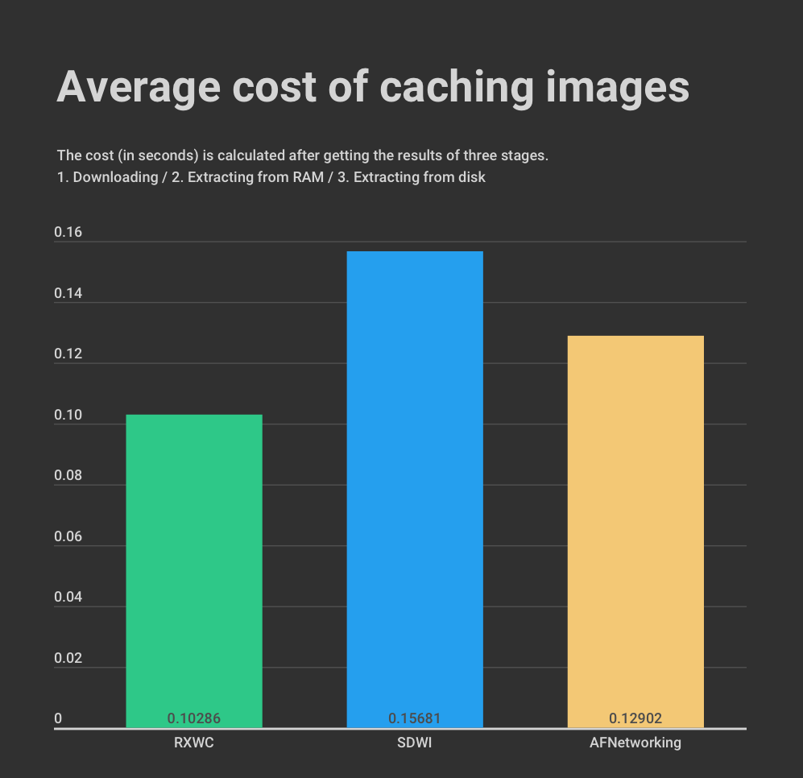
</p>

This graph shows a comparative performance test of three leading mobile technologies.

Testing takes place in three stages.

**1)** Images are downloaded and cached.

**2)** Images are extracted from the cache in RAM.

**3)** Images are extracted from the cache on disk.

**The average arithmetic numbers shown on the graph contain the average speed obtained from the addition of time indicators for each testing stage (downloading/extracted from RAM/extracted from disk).*

<br>

## 💡 The concept of the framework

The framework concept is based on the fact that there are two basic classes that manage the entire cache.

**RXWebCache** - interacts only with local storage.<br>
**RXWC_RecievieItemOperation** - interacts with local storage and, if necessary, downloads data from the Internet.
<br>

.png)

<br>

## 🏞 Image caching

You can cache an image using two different approaches:

| 1)  | Use the category `UIImageView+RXWC` (asynchronous methods only).                                                                                                                                                                                                                                     |
|:--- |:---------------------------------------------------------------------------------------------------------------------------------------------------------------------------------------------------------------------------------------------------------------------------------------------------- |
|     | To use this approach, you will need to have an instance of `UIImageView` on behalf of which the caching method will be called.<br/>  <br/>The advantage of this approach is its ease of use. You only need to have an instance of `UIImageView`, the rest of the work will be done by the framework. |

<br>
<br>

| 2)  | Create an operation object of the `RXWC_RecievieImageOperation` class (synchronous methods are also available).                                                                                                                                                                                                                                                                                                                                                                                                                  |
|:--- |:-------------------------------------------------------------------------------------------------------------------------------------------------------------------------------------------------------------------------------------------------------------------------------------------------------------------------------------------------------------------------------------------------------------------------------------------------------------------------------------------------------------------------------- |
|     | With this approach, you will need to initialize the operation each time, run it manually, or put it in a queue.<br/>  <br/>And after a successful download procedure, insert an instance of `UIImage` in `UIImageView`.<br/>  <br/>One of the advantages of this approach is that the `RXWC_ReceiveImageOperation` class supports synchronous caching mode.<br/>  <br/>This can allow you to avoid `callback-hell` in situations where you need to wait for all components to load. And display them all together on the screen. |

<br>

### ⚙️ General settings for each caching approach

### 🎭0️⃣ 1️⃣ Bit mask RXWC_ImageViewOptions

If you want to cache images using the **RXWebCache** library, you will definitely encounter the `RXWC_ImageViewOptions` bit mask.

This mask contains all sorts of settings related to caching and drawing images.

**Features that it provides:**

| 🤖  | List of technologies that can be used to draw an image                      |
| --- | --------------------------------------------------------------------------- |
| ✅   | **ImageIO**     (fastest technology)⚡️ (recommended for most medium images) |
| ✅   | **CoreGraphics**                                                            |
| ✅   | **UIKit**                                                                   |
| ✅   | **CoreImage**                                                               |
| ✅   | **VImage**                                                                  |

<br>

| ⚙   | Image rendering parameters                                                                   |
| --- | -------------------------------------------------------------------------------------------- |
| ✅   | Return the binary code to the user so that he can draw the picture on his own.               |
| ✅   | Whether to crop the image at the edges of 'UIImageView' (if the image goes out of bounds)    |
| ✅   | Whether to compress an image if it is larger than the `UIImageView`size                      |
| ✅   | Ability to get an image of the original size (without processing by the framework)      <br> |

<br>

| 🔍  | Search settings                 |
| --- | ------------------------------- |
| ✅   | To carry out the search in RAM  |
| ✅   | To carry out the search on disk |

<br>

| 🍭  | Other features provided by the library                                                            |
| --- | ------------------------------------------------------------------------------------------------- |
| ✅   | Ability to select the thread on which `progressBlock` will be called                              |
| ✅   | Ability to select the thread on which `completionBlock` will be called                            |
| ✅   | Ability to decide whether to store the data model (with binary code) describing the image in RAM. |
| ✅   | Whether to store the rendered image itself in RAM                                                 |

<br>

You can see the full list of parameters in the image.
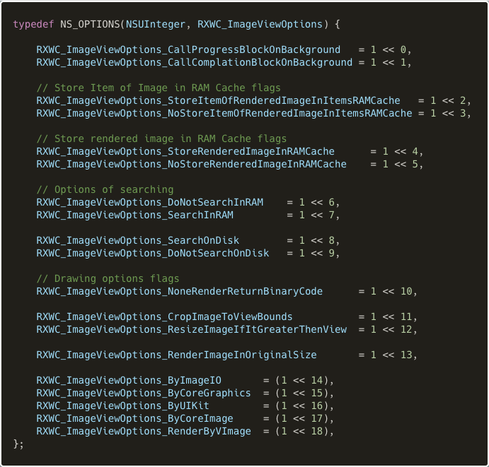

---

### 🎭❗️❓ The duality of values in the bitmask

You may have noticed that the same mask may have mutually exclusive flags, for example such as `.SearchOnDisk` and `.DontSearchOnDisk`. <br/>This dual implementation of flags is necessary in order to be able to configure global caching parameters and individual ones for each individual image as flexibly as possible.

By the way, the value passed to the `options:(RXWC_ImageViewOptions)options` parameter will always have higher priority over the `UIImageView.defaultOptions` value.

For example, if by default all images are cached in RAM, if you pass the `.NoStoreRenderImageInRAMCache`  flag, this particular image will not be added to `NSCache`.

---

### ⏰📅 Expiration date of items in the cache

If the method that you call to cache data does not have an argument that accepts cache storage time, the storage time of the element will be taken from the property of the `RXWebCache`class.

The default value is `RXWC_OneDayTerm` (i.e. the item is stored in the cache for exactly 24 hours). <br>
By the way, you can edit it yourself.


Also, if you don't pass "`storage time`" to the method that accepts this argument, or pass an invalid date, such as `nil` to `NSDate`, or an invalid `timeStamp`, or the appropriate `enum` value - `RXWC_DontSaveInCache` then the downloaded item will not be saved in the database.

---

### 🌁 💾 Properties of the RXWebCache class related to image caching

The `RXWebCache` class has a collection in which you can optionally store previously downloaded and rendered images.


As a rule, this can be very useful when working with table views.
That is, when you scroll through the list with pictures, the framework does not need to access the database on the disk every time, load the binary code and draw a picture from it.
The algorithm simply takes the prepared image out of RAM.

To do this, you will need to set the appropriate flag `RXWC_ImageViewOptions_StoreRenderedImageinRAMCache` or `UIImageView.defaultOptions` so that images are always saved in RAM, even if you have not explicitly passed this flag to the caching method.
Or pass the flag every time the method is called.

The cache has the following structure:

```objectivec
/*--------------------------------------------------------------------------------------------
  The cache stores images of different sizes
  The structure of the cache:
     @{             
      |  "url" : @[     // A subdictionary that contains different params.
      |           |     // In other words a request can be made to the same url,
      |           |     // but with different params, then the pictures can be obtained different.
      |           |    @{  "params" : params,
      |           |     |  "expire" : date,
      |           |     |  "sizes"  : @{
      |           |     |              | nsValue(cgSize60x60) : image,
      |           |     |              | nsValue(cgSize80x80) : image,
      |           |     |              | nsValue(cgSize90x90) : image
      |           |     |              }
      |           |     }
      |           ],
      }
 --------------------------------------------------------------------------------------------*/
```

If you pass the flag `RXWC_ImageViewOptions_ResizeImageIfItGreaterThenView` to the` options` argument, then provided that the picture is larger than `UIImageView`, it will automatically be compressed to the size of` UIImageView` (compression with saving sides and taking into account the value in `contentMode`)

Since the framework algorithms are highly optimized, if you request the same image for different `UIImageView` (with different sizes),for example, a user profile photo and a small avatar, the internal mechanism will cache copies of different sizes.
(As shown above in the cache structure).

---

In addition, `RXWebCache` allows you to set limits on the amount of RAM used for the entire cache of images.
And you can also set restrictions for each individual image that the framework will try to add to the cache.

For example: "It is impossible that the size of one image exceeds 10MB."


<br>

### Caching images using the UIImageView+RXWC category

The **UIImageView+RXWC** category has only one public property.

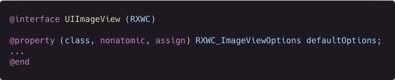

This property contains default settings.
They are required so that if you didn't pass any necessary flag to the method, it is imported from the `defaultOptions` property.<br>For example, if you didn't pass the name of the technology to which the image should be drawn.

---

- **Overview of methods from UIImageView+RXWC**

The following is an example of the simplest asynchronous category method.

As settings, the flags "`cropping Photos On UIImageView Borders`" and "`rendering using ImageIO technology`".

[Copy code](Documentation/TextSnippet/imgURL-options.txt) <br>
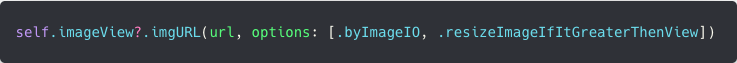

---

- **Expiration dates in UIImageView+RXWC**

Since the main task of the library is to cache images, we logically face the question of clearing the cache.

`Convenience` methods in the `UIImageView+RXWC.h` does not have a custom parameter that the user can pass the storage period of the image in the cache to.

Therefore, the time that elements will be stored on the disk will be taken from the `defaultTimeTermForStoreItemInCache` property which is in the `RXWebCache` class.

---

- **Categories with expiration dates**

But if you still want to manually set the storage period for each individual image.
Then pay attention to the categories:
 (`RXWC_ExpireDateAsNSDate` / `RXWC_ExpireDateAsEnum` / `RXWC_ExpireDateAsTimeStamp`).

They contain methods that allow you to set storage periods in a format that is convenient for you. <br>You can pass the expiration date as an `NSDate` object, as an enum `RXWC_TimePeriodEnum`, or as a string in the `TimeStamp`format.

**RXWC_ExpireDateAsNSDate**  - takes `NSDate`.

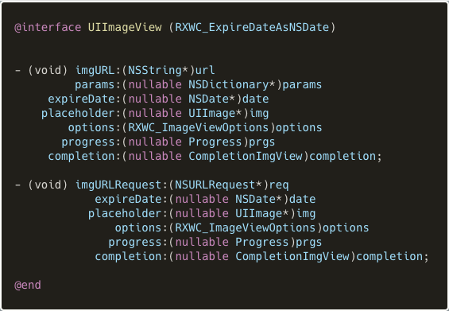

**RXWC_ExpireDateAsEnum** - takes `enum RXWC_ImageViewOptions`.

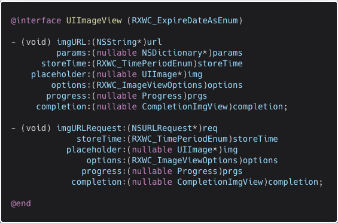

**RXWC_ExpireDateAsTimeStamp** - takes `timeStamp NSString`.


---

- **UIImageView+RXWC together with table views**

The most popular method that caches images is ` - imgURL:options:progress:`. <br>Call it in the method`-collectionView:cellForItemAtIndexPath` (if you use `UICollectionView`).<br>And appropriately`-tableView:cellForRowAtIndexPath:` (if you work with `UITableView`).

[Copy code](Documentation/TextSnippet/imgURL-options-progress.txt)<br>


Also don't forget to **cancel** image caching if the cell was hidden from the view by scrolling.
To do this, call the  `-cancelCachingImage` method in the appropriate table view methods.

Solution for `UICollectionView`:

[Copy code](Documentation/TextSnippet/collectionView-didEndDisplayingCell-forItemAtIndexPath.txt)<br>


Solution for `UITableView`:

[Copy code](Documentation/TextSnippet/tableView-didEndDisplayingCell-forRowAtIndexPath.txt)
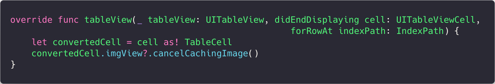

---

<br>

We also recommend that you pay attention to this property located in the class **RXWebCache**.


All caching methods in the `UIImageView+RXWC` category internally create instances of `RXWC_RecievieItemOperation` operations that are always executed in the `retrieveitemsoperationsqueue` queue.

If you use caching methods from `UIImageView+RXWC` in table views, where there is reason to assume that the user will want to cache hundreds of images simultaneously in a few seconds of scrolling, you can (depending on the device) control the number of simultaneous operations in the queue.

By default, this value is equal to **6** operations.
If you think that this value is not optimal in your case, then set a different value.

```objectivec
RXWebCache.retriveItemsOperationsQueue.maxConcurrentOperationCount = 10;
```

---

<br>

### Caching images using RXWC_ReceiveImageOperation

- **The synchronous approach**

As mentioned earlier, the main advantage of **RXWC_ReceiveImageOperation** over **UIImageView+RXWC** this is the fact that You do not need to have an instance of `UIImageView` (to call the caching method) and that it is possible to cache the image synchronously.

**RXWC_ReceiveImageOperation** it will be useful if you need to wait for all graphic elements to be downloaded first, and then present them all together on the controller.

All synchronous methods start with the `sync_ ' prefix.

In the example below, two images are downloaded synchronously.. <br>All code is wrapped in a `GCD` block so as not to slow down the main thread.<br>

⚠️ <u> Remember that synchronous methods block this thread on which they were called.</u><br>     So if you are using standard queues somewhere else **GCD** (`dispatch_get_global_queue`),
if you call the caching method on this queue, you will block the thread until the operation is completed.

Therefore, we recommend calling synchronous methods on self-created `GCD` queues.

[Copy code](Documentation/TextSnippet/RXWC_ReceiveImageOperation_sync_Case.txt)


---

- **Asynchronous approach**

Here is a section of code that performs asynchronous caching of the image.<br>Note that the `-retainOperationAndStart` method is called on behalf of the operation.

Since **RXWC_ReceiveImageOperation** is the descendant of the **NSOperation** class, you have the right to choose how to start the operation.

 **1)** You can do this by inserting the operation into the queue.(**NSOperationQueue**).
    Then the queue itself will hold the `strong` link to the operation.

 **2)** Call the method - **start**, but then you yourself will need to have a strong link to the operation.
      So that it is not instantly deleted from memory.

**3)** Call the `-retainOperationAndStart` method, which will use an internal mechanism to hold a strong reference to itself. And then delete yourself from memory.
       Therefore, we recommend using the `-retainOperationAndStart` method. <br>

[Copy code](Documentation/TextSnippet/RXWC_ReceiveImageOperation_async_Case.txt)


---

<br>

- ⚠️ What to pay attention to when using **RXWC_ReceiveImageOperation**

| **Features of interaction with RXWC_ReceiveImageOperation**                                                                                                                                    |
| ---------------------------------------------------------------------------------------------------------------------------------------------------------------------------------------------- |
| **1)** If you pass the **CGSizeZero** structure to the `size:(CGSize)sizeInPoints` parameter, the image will be drawn to its original size.                                                    |
| **2)** Also, if the method does not have a parameter responsible for the image size, the image will be drawn in its original size.                                                             |
| **3)** If you pass `null` to `expireDate:(NSDate*)expireDate` or to `expireTimeStamp:(NSString*)expireTimeStamp` then the downloaded element will not be saved in the database.                |
| **4)** If the method does not have a parameter for the storage period of the element in the cache, it means that the value will be taken from `RXWebCache.defaultTimeTermForStoreItemInCache`. |
| **5)** If you don't pass a critical important flag to the method (for example, rendering technology), then borrow from ' UIImageView.defaultOptions` <u>WILL NOT!</u>.                         |

<br>

## 📖 Caching json files using RXWC_ReceiveDictionaryOperation

The **RXWC_ReceiveDictionaryOperation** class is a direct descendant of **RXWC_ReceiveItemOperation**.<br>It is essentially a regular wrapper that provides `synchronous` and `asynchronous` methods that return the `NSDictionary` object to the user.

The class works in the same way as `RXWC_ReceiveImageOperation`.<br>An example of a synchronous and asynchronous case is shown below.

- Synchronous approach to caching a `json` file.

[Copy code](Documentation/TextSnippet/sync_dictAtURL.txt)


- Asynchronous approach to caching a `json` file.

[Copy code](Documentation/TextSnippet/async_dictAtURL.txt)
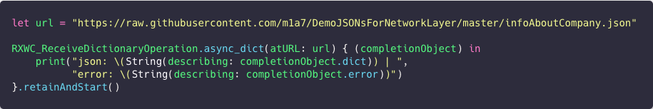

<br>**RXWC_ReceiveDictionaryOperation** it has similar limitations to it **RXWC_ReceiveImageOperation**.

| **Features of interaction with RXWC_ReceiveDictionaryOperation**                                                                                                                                |
| ----------------------------------------------------------------------------------------------------------------------------------------------------------------------------------------------- |
| **1)** If you pass `null` to `expireDate: (NSDate*) expireDate` or to `expireTimeStamp:(NSString*)expireTimeStamp` then the downloaded element will not be saved in the database.               |
| **2)** If the method does not have a parameter for the storage period of the element in the cache, it means that the value will be taken from `RXWebCache.defaultTimeTermForStoreItemInCache`.  |
| **3)** If you don't pass the `RXWC_RIO_Options` mask to the corresponding parameter, the value inside the method will be borrowed from the `RXWC_ReceiveItemOperation.defaultOptions` property. |

---

<br>

## 💾 Caching any data using RXWC_RecievieItemOperation

As has been described above, fraemwork `RXWebCache` provides different classes of heirs `NSOperation`, which work on the same principle as **RXWC_RecievieItemOperation** only convert the resulting binary code into instances of different classes,  **RXWC_ReceiveImageOperation** - `UIImage`, **RXWC_ReceiveDictionaryOperation** - `NSDictionary`. <br>
In essence, they are wrapper classes over **RXWC_RecievieItemOperation**.

Since it is impossible to write wrapper classes for every case, there is a base class **RXWC_RecievieItemOperation** for this, which caches binary code and returns cached data in the `NSData` format to the user.

The class works by the following principle:

1) Searches for `url` + `params` in local storage (RAM and disk). And returns if it finds. Or deletes if the expiration date has expired.

2) Begins the procedure for downloading the item and the subsequent procedure for writing to disk.

Also **RXWC_RecievieItemOperation** - supports synchronous and asynchronous caching mode.

In the demo examples below, we will look at each of the possible caching cases.

There may often be a situation when you need to download a text file.<br>In this example, we do this using the synchronous method.

[Copy code](Documentation/TextSnippet/sync_itemAtURL.txt)
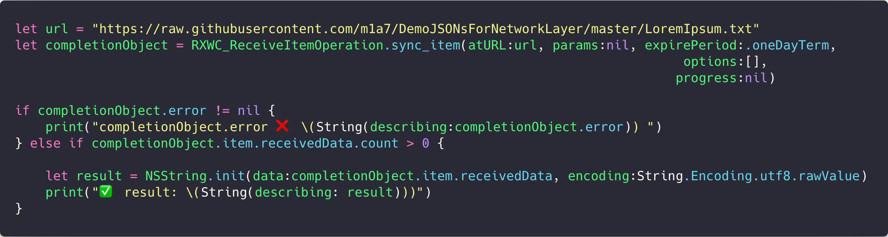

Here we synchronously download and cache the image.<br>⚠️ Pay attention to one very important thing. <br>When you call a synchronous method, it blocks the thread from which it was called.<br>Accordingly, You may find yourself in a situation where you call the method on the main thread, and progressblock does not work.<br>
This effect can occur because by default `progressBlock` is called on the main thread, and how can it be called if the thread is blocked until the image is fully downloaded and cached.

**So there are two ways out of this situation:**

1) Call the synchronous method on the background thread.

2) Or call it on the main thread, but simultaneously pass the `RCWC_RIO_Option_CallProgressBlockonbackground` flag.

[Copy code](Documentation/TextSnippet/sync_itemAtURL-image.txt)


<br>

Example of working with an asynchronous method of the class.

[Copy code](Documentation/TextSnippet/initWithURL-json.txt)


---

<br>

## 🚀 RXWebCache

The main class of the framework. Implements methods for interacting with the database (`add`/`delete`/`extract` , etc.)

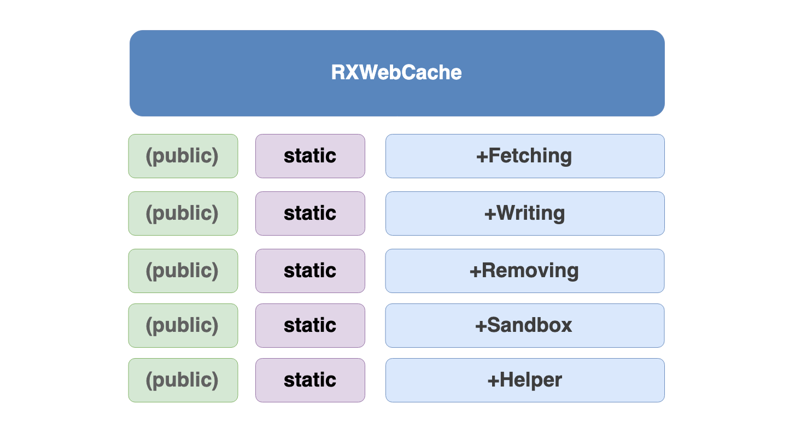

### Overview of main  methods

In the `RXWebCache.h` presents properties that configure the entire framework.
For example, by setting the appropriate flag in the `RXWebCache.options` You can enable logging.

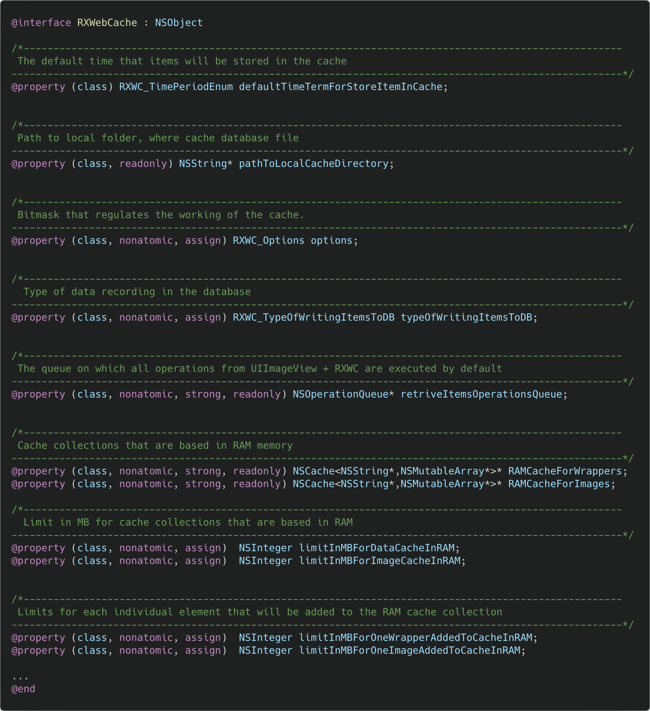

Also `RXWebCache.h` contains methods for adding models and images to cache collections that are based in the database.<br>A method for clearing caches and a method that provides information about the framework.

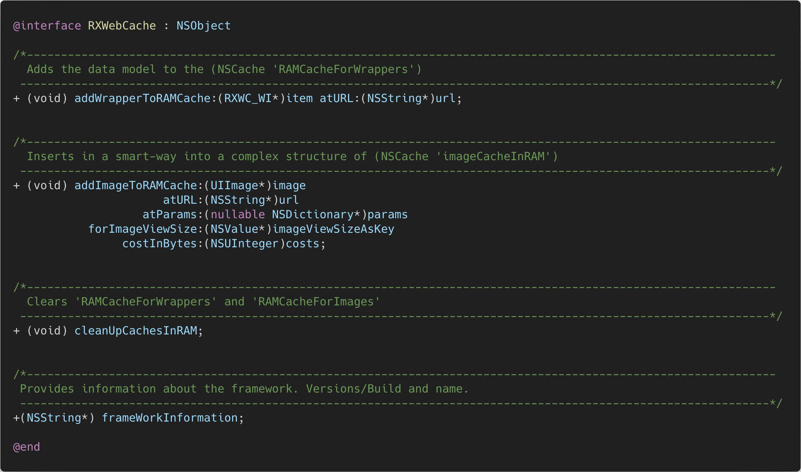

---

### Overview of Writing  methods

The category provides two methods that convert and write wrapper objects `RXWC_WrapperItem` to `RXWC_Item`.

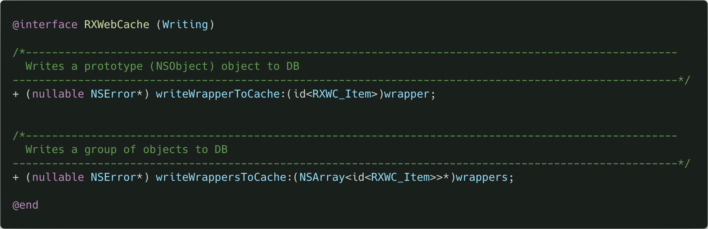

### Example:

By the way, if you want to cache a certain object that was created locally on the device (for example, a certain drawing), you can create an object `RXWC_WrapperItem`convert the drawing to `NSData` format, insert `receivedData` into the property, then come up with a constant name and save the object using one of the two category methods.

[Copy code](Documentation/TextSnippet/RXWebCache-Writing-Example1.txt)
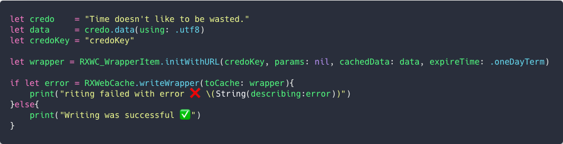

---

### Overview of Fetching methods

In this category, class methods are presented that allow you to both extract individual elements from the cache and get general information, for example, the total number of objects in the database.

The element is mainly searched for from the information from which source it was received. (`url`+`params` ).<br>You can also pull an item by index (i.e., serial number).

I would like to draw your attention to the fact that with the **RXWC_ItemCollection** class you can create very flexible search selections using `NSPredicate` /  `KVC` / `NSSortDescriptor` and other technologies.


### Example

This example uses the `fetchWrapperFromDiskAtGlobalURL: params` method, which retrieves an object from the device’s hard drive.
[Copy code](Documentation/TextSnippet/RXWebCache-Fetching-Example1.txt)

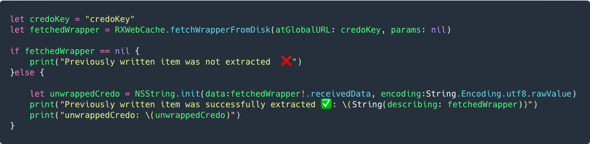

---

### Overview of Removing methods

Below you will find methods for deleting objects from the database.<br>Also, the ability to remove oneself from the database can be done by some of the objects `RXWC_WrapperItem` (which were obtained from the methods of the category` RXWebCache + Fetching`) and the collection `RXWC_ItemCollection`, for this they have their own helper methods `-isCanBeDirectlyRemovedFromDB` and `-directlyRemoveBrapper`.

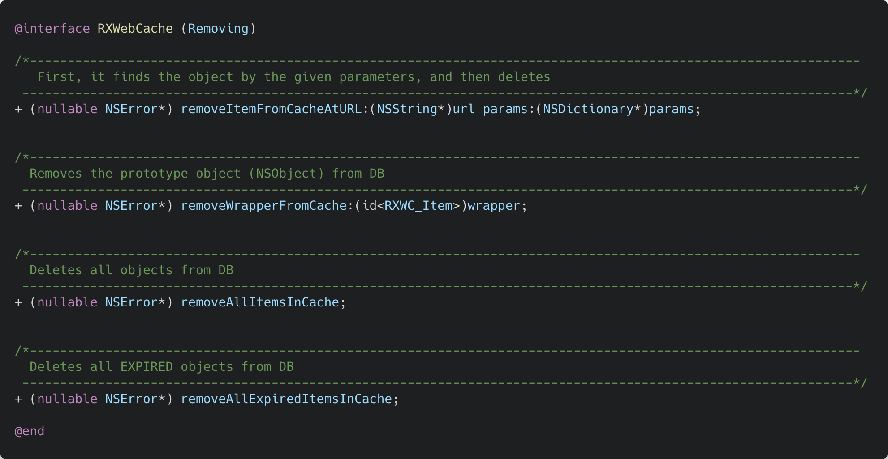

### Example:

In this case, the `+removeItemFromCacheAtURL:params:` method itself searches for the required instance in the database, and if it does, it performs the removal procedure.

[Copy code](Documentation/TextSnippet/RXWebCache-Removing-Example1.txt) <br>


And here we pass to the method a specific object that will be deleted.
[Copy code](Documentation/TextSnippet/RXWebCache-Removing-Example2.txt)


---

### Overview of Sandbox  methods

In the **Sandbox** category, you get access to methods that can return the path to the directory where cached database files are located, as well as physically erase this directory.


---

### Overview of Helper   methods

Since the **RXWebCache** framework it has a very extensive functionality, so that users can effectively use the library, the `Helper` category was created, which contains various methods useful during code debagging.

By the way, many static methods of `RXWebCache` return an instance of `NSError` as the return type, which contain an internal dictionary with a detailed description of the problem and a possible way to solve it.

  

### Example:

This example examines the case where the `+memorySizeFromImage:`method is used.<br>The architecture of the framework allows the user to add pictures to the `NSCache RAMCacheForImages`,but since the library assumes the obligation to clear the cache if the limit of stored data is exceeded, then you should definitely transfer images to the cost method, that is, information how much space it occupies in bits.

[Copy code](Documentation/TextSnippet/addImageToRAMCache.txt)<br>


---

<br>

## 🗄 RXWC_ItemCollection

Class **RXWC_ItemCollection** is a thread-safe wrapper over the class `RMLResult` (`Realm` technologies).<br>
The main task of the class is to extract from the database a group of objects united by one or more details (for example, by the `creation date`,` url`, etc.).

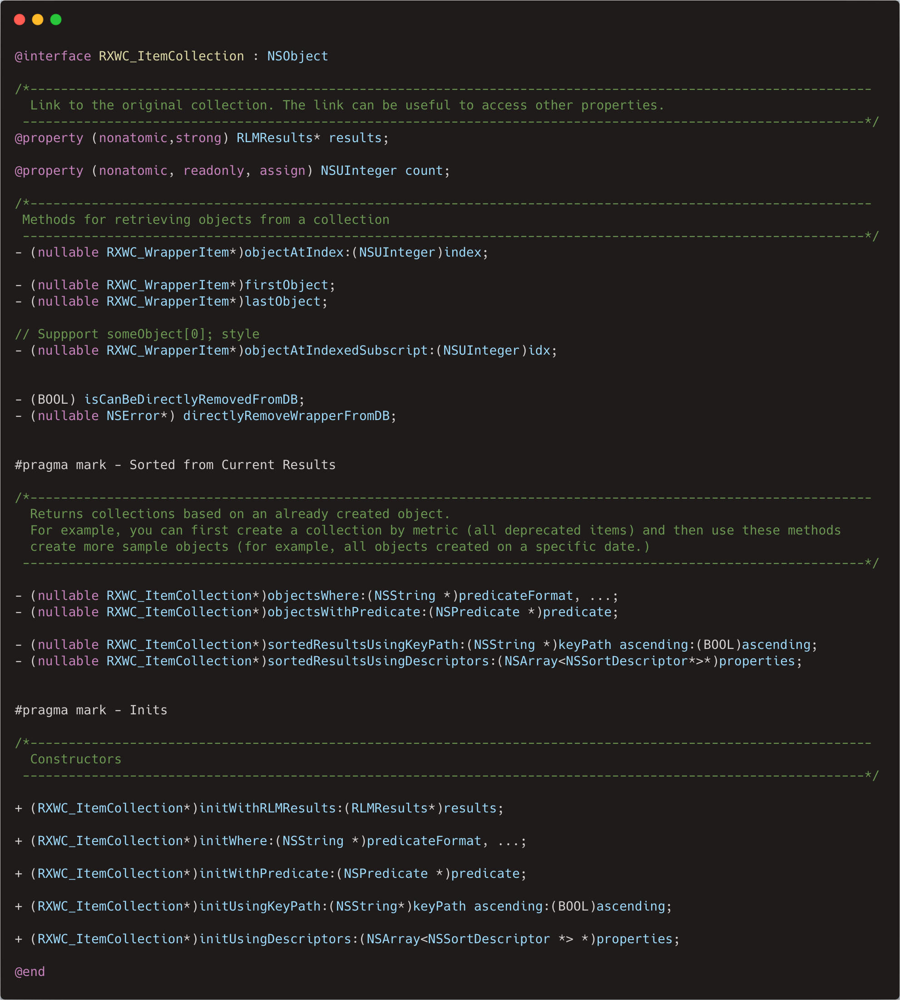

Since the class is just a thread-safe wrapper, the search query is compiled according to the rules set by the `Realm` technology. <br>

To do this, we recommend that you read the relevant chapter. [Queries](https://realm.io/docs/objc/latest/#queries) of their documentation. And [cheat sheet NSPredicate](https://academy.realm.io/posts/nspredicate-cheatsheet/).

### Examples:

**+initWhere:**

```swift
let collection = RXWC_ItemCollection.initWhere("url == '\(url)'")
let collection = RXWC_ItemCollection.initWhere("url BEGINSWITH 'pp.userapi.com'")
let collection = RXWC_ItemCollection.initWhere("url ENDSWITH   '.jpg'")
let collection = RXWC_ItemCollection.initWhere("url  CONTAINS  'sun6-2.userapi.com'")

```

**+initWithPredicate:**

```swift
let validItemsPredicate = NSPredicate(format: "expireStoredItemInCacheDate > %@", NSDate.init())
let expiredItemsPredicate = NSPredicate(format: "expireStoredItemInCacheDate <= %@", NSDate.init())

let validCollection = RXWC_ItemCollection.initWith(validItemsPredicate)
let expiredCollection = RXWC_ItemCollection.initWith(expiredItemsPredicate)

let specifedURLAndValidItemsPredicate = NSPredicate(format:"url == %@ AND expireStoredItemInCacheDate > %@",url, NSDate.init())
let collection = RXWC_ItemCollection.initWith(specifedURLAndValidItemsPredicate)
```

**+initUsingKeyPath:ascending:**

```swift
let collection = RXWC_ItemCollection.initUsingKeyPath("addedItemInCacheDate", ascending: true)
```

**+initUsingDescriptors:**

```swift
let sortDescriptor = NSSortDescriptor.init(key:"addedItemInCacheDate", ascending: false)
let collection = RXWC_ItemCollection.initUsing([sortDescriptor])
```

<br>

### 🗂 How files and folders are structured in the sandbox

The folder where the database files are based is located at: `~Library/Caches/RXWebCache`.

Since the **RXWebCache** framework as a database uses the `Realm` technology (which has a restriction on storing data inside the `.realm` file that does not exceed **16MB**), then inside the `RXWebCache`folder there is a `FileMore16MB ' subfolder that stores large files.

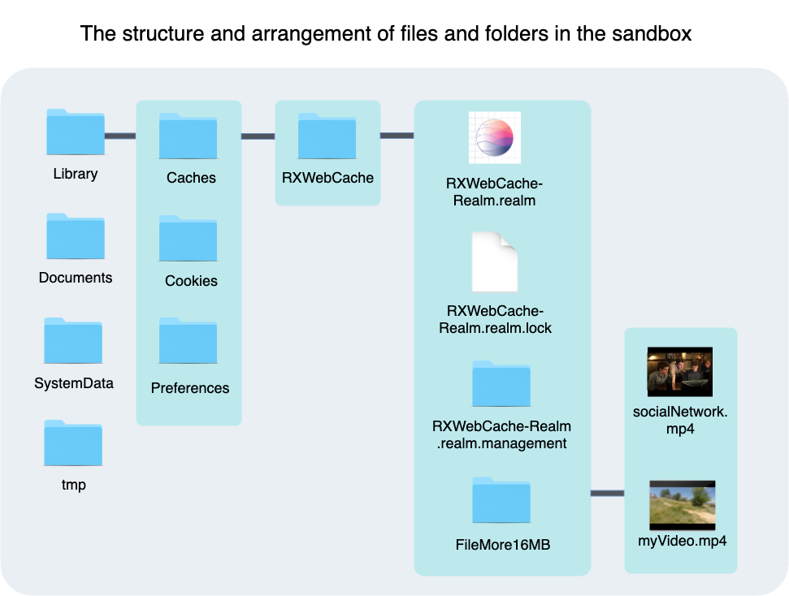

If you test the operation of the framework on the simulator you have the opportunity to track changes in real time simply by opening the desired directory.

To find out the path to your app's sandbox, put this code in the `-didFinishLaunchingWithOptions`method.

```swift
 print("NSHomeDirectory() \(NSHomeDirectory())")
```

After opening the terminal, write the `open` command, put a space and insert the path from the console.

```bash
open data/Cotainers/Application/197467127COD3-4A89-AE84-AG11-8FF39C68EDOB
```

---

Also, if you want to manually manipulate the data in the `.realm` file, we recommend that you download [Realm Studio](https://realm.io/products/realm-studio/).


## 🏎 Technologies that are used inside RXWebCache


**RXNetworkOperation**  - responsible for connecting to the network. <br>
**Realm**               - responsible for the database.<br>
**FCFileManager**       - responsible for interacting with the app's sandbox.<br>

<br>

## 🍫 Recommendations

If the application takes up a large amount of RAM (as a percentage for each device), and the system calls the  `-applicationDidReceiveMemoryWarning` method, we recommend calling the `+cleanUpCachesInRAM` method which will clean the `NSCache` collections.

```swift
func applicationDidReceiveMemoryWarning(_ application: UIApplication) {
    RXWebCache.cleanUpCachesInRAM()
}
```

---

To delete expired objects in a timely manner, we recommend calling the `+deleteAllExpiredItemsInTheCache:`
in  `-didFinishLaunchingWithOptions:`.

This method can be called at any time when you need to clear disk space, as well as space in RAM.

```swift
func application(_ application: UIApplication, didFinishLaunchingWithOptions launchOptions: [UIApplication.LaunchOptionsKey: Any]?) -> Bool {       
  
  RXWebCache.removeAllExpiredItems(inCache:[])
}
```

---

You can also recommend a responsible approach to configuring the image caching policy.<br>

For example, it is recommended to draw a picture in its original size only in exceptional cases (when it is likely that the user can use the `zoom in` gesture).
<br> 
 In all table views (`UITableView`/`UICollectionView`), we strongly recommend caching the image along with the `RXWC_ImageViewOptions_ResizeImageIfItGreaterThenView` flag.

---

An important factor affecting the efficiency of the library is the policy of recording elements in the database.

If your application does not require absolute and instant data caching to disk, we recommend enabling group recording in the `-didFinishLaunchingWithOptions` method.

```swift
RXWebCache.typeOfWritingItemsToDB = .groupWritingByCountLimit;
RXWC_StorageForGroupWrappersWriting.numberOfAddedWrappersAfterWhichTheyWillBeWrittenToDB = 40
```

This will prevent the system from wasting additional resources when writing to disk.

The fact is that the internal structure of the `Realm` technology is such that "**open the gate**" in the storage for recording a group of objects is less expensive than spending time on "**opening the gate**" and synchronizing data between DB managers on different threads for each object separately.

---

<br>

## 🎖 Performance test

Below you can see the test schedules. For comparison, two technologies `RXWebCache` and `SDWebImage`are being tested.

Testing takes place in three stages:

1. **Initial download**. (At this stage the image is downloaded for the first time and cached in RAM and on disk).

2. **Extracting from RAM**. (The previously rendered image will be requested from the collection`NSCache`).

3. **Recovery from disk**. (The image is initialized from binary code that is extracted from the device's disk).

Performance is measured in the amount of time (`in seconds`) that was spent getting,recording, and rendering an image.

<p align="center">
  
</p>

<p align="center">
  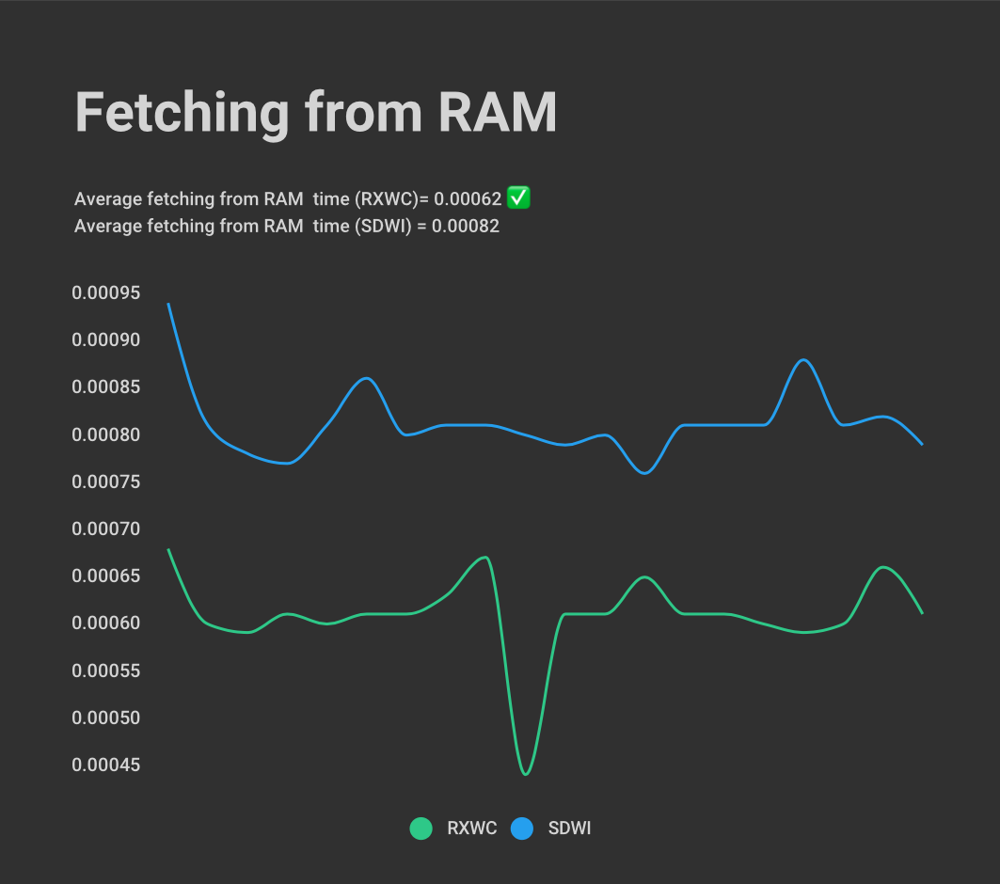
</p>

<p align="center">
  
</p>

You can see the values that the graphs were based on in this table.

Finding the average value from all testing modes, it turns out that **RXWebCache** `works faster than` **SDWebImage** <u>~1.5 times</u>.

**It is important to say that the first stage of testing (i.e. downloading) is quite unpredictable due to the constantly changing Internet speed.
Therefore, the test results may differ slightly from each other.*

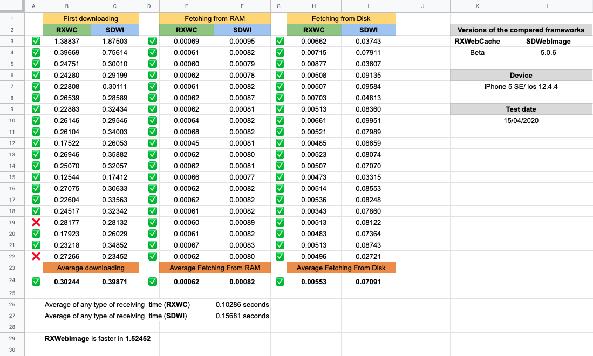

In order to perform a comparison test yourself, the `CompareRXWebCacheWithSDWebImage_test` class was created in the test project. It has several testing methods (`separate`/`simultaneous`).

Paste this code into the `-didFinishLaunchingWithOptions` method:  and delete `Entry Point` if you are using `storyboard`.

[Copy code](Documentation/TextSnippet/CompareRXWebCacheWithSDWebImage_Test.txt)


The more links you specify in the `urls` array, the longer testing will take. <br>By default, testing 20 images takes about 5 minutes.
After that, the results will be printed to the console.

<br>

## 📲 Compatibility

The framework was written in the `Objective-c` language, which allows the technology to be compatible with both `ObjC` projects and `Swift`.

| Objective-c Projects | Swift Projects | Minimum ios version |
|:--------------------:| -------------- |:-------------------:|
| ✅                    | ✅              | `ios 8+`            |

To work in the Swift project, a special version of the `RXWebCacheSwiftSDK` framework was created.
<br>

## 🎯 How to connect a framework to a project

**Step 1**

Create `Frameworks` folder in your project folder and copy the `RXWebCacheSDK.frameworks` file to it, as well as other frameworks that are used inside `RXWebCache`.

Drag `RXNetworkOperation.framework` and `Realm.framework`.

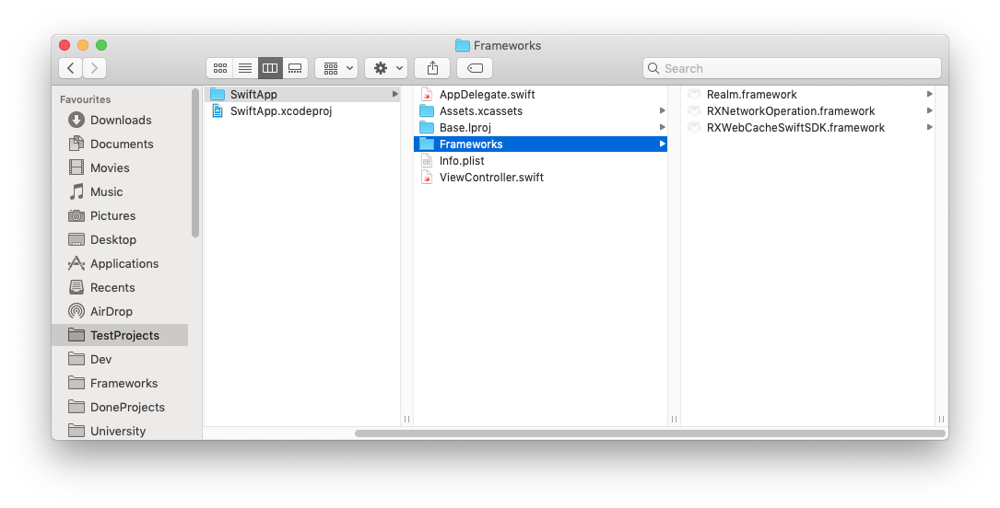

**Step 2**
Drag the folder with the nested framework into the project structure.

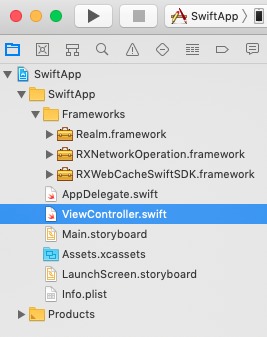

**Step 3**

On the tab **General** add `RXWebCacheSDK.framework`,`Realm.framework`,`RXNetworkOperation.framework` in the section **Embedded Binaries** and **Linked Frameworks and Libraries**.

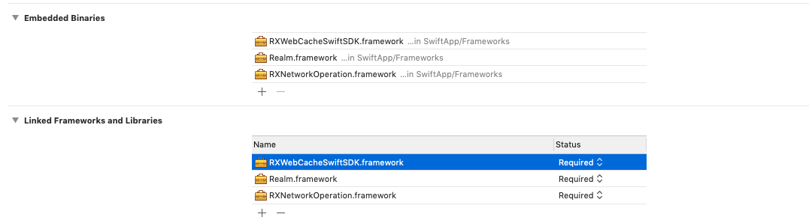

<br>

**Step 4**

Create an `Objective-c` file in your project (if it hasn't been created yet).


Next **Xcode** automatic prompts you to create a "**bridging header**" (if you haven't already created it).
Click **Create Bridging Header**.


<br>

**Step 5**

Import the names of **Objective-c** classes and frameworks that you want to use in the main **Swift** project.

```objectivec
#import <RXWebCacheSwiftSDK/RXWebCacheSwiftSDK.h>
#import <Realm/Realm.h>
#import <RXNetworkOperation/RXNetworkOperation.h>
```

<br>

**Step 6**

Add `UIImageView` to your `Storyboard` to test the library's functionality.

```swift
import UIKit
import RXWebCacheSwiftSDK

class ViewController: UIViewController {

    @IBOutlet weak var imageView: UIImageView!
    
    override func viewDidLoad() {
        super.viewDidLoad()
          let url = "https://sun9-20.userapi.com/c543109/v543109246/5a3d3/d65h8OaQx8w.jpg"
          imageView.imgURL(url, options: .byImageIO)
    }
}
```


<br>

## 📜 History of creation

The author, like most **iOS** developers, used the `SDWebImage` library for caching images.

But in the process of developing applications, I have a need to cache not only photos, but also control the storage life of each individual element in the cache.

And over time, there was a desire to make the process of setting the storage period and deleting expired elements comfortable for the developer.

This is how the `RXWebCache` (`RXWC`) framework appeared.

During development - `RXWC` has grown and developed from the initial idea (to cache images) to a technology that allows you to cache any data and perform this process very flexibly - providing the user with the full range of settings.

At the moment, the framework has several additional subclasses and categories that not only cache data, but immediately process and convert it to an instance of `NSDicitonary` or `UIImage`.

At the moment, the framework has several additional subclasses and categories that not only cache data, but immediately process and convert it to an instance of `NSDicitonary` or `UIImage`.

<br>

## 🛣 Prospects for use

Most `iOS` applications can be described as `client-server`, which means that most applications need to make network requests (and possibly cache server responses).

The features provided by the framework allow you to say that `RXWebCache` it can become a full-fledged replacement for your own network layer in small applications.

Since the library performs several functional loads at once:

1. Downloads data from the Internet.
2. Writes the received information to the database.
3. Processes and converts binary code into an instance of the class you need.

The library can also be effective when you need to quickly develop and implement a new feature in an existing application, where adding new methods (that perform the function of communicating with the `API`) to the network layer architecture is labor - intensive.

<br>

## 🗿 Framework Architecture Philosophy

The philosophy of the framework is based on the life credo of **Henry Ford**.


Therefore, the freemovrk was built in such a way that the user did not need to keep links to Manager objects in the application's memory, and think about an abstraction that would allow access to the library from different points in the application.

This is why `RXWebCache` provides many static functions (i.e. class methods) that can perform a wide range of tasks without requiring the user to create and hold library objects in memory.

The framework allows you to solve most problems using two approaches:

1. Processes that were initiated by static methods             - **cannot be** canceled.
2. Processes that were initiated on behalf of operation objects- **may be** interrupted.

For example, if you are trying to extract data from the cache, you can do this without creating any objects using the `RXWebCache`class. (But then the extraction process cannot be interrupted), or you can do this using an instance of the `RXWC_RecievieItemOperation` class - which allows you to fully control any process.

<br>

## 🧬 Credo of fraemwork

> "Leave the caching of data to us, and concentrate on the initial idea.".

## 

## Decoding the credo

Every time, do not waste time building an abstraction that will receive and cache data.
Leave this work to us, and focus on developing the functionality that users will return to your app over and over again!

<br>

## 🗃 Purpose of each class

     Below you can see brief descriptions for each class.

#### Main class

| 🚀 RXWebCache                                                                                                                                                                                                |
|:------------------------------------------------------------------------------------------------------------------------------------------------------------------------------------------------------------ |
| Class `RXWebCache` and its categories implement static methods for interacting with the database (`add`/`delete`/`extract`, and so on.)<br>To do this, you do not need to create additional manager objects. |

<br>

#### **Operations (inheritors of NSOperation)**

|      | Name                                | Description                                                                                                                                                                                                                                                                                                                                                                                                                                                                                                                                                                                                     |
| ---- | ----------------------------------- | --------------------------------------------------------------------------------------------------------------------------------------------------------------------------------------------------------------------------------------------------------------------------------------------------------------------------------------------------------------------------------------------------------------------------------------------------------------------------------------------------------------------------------------------------------------------------------------------------------------- |
| 🔮   | **RXWC_RecievieItemOperation**      | Class `RXWC_RecievieItemOperation` (short, `RXWC_RIO`) (and successor classes), which provide the user only constructors to which the developer must pass information (**url** + **params** etc.) from which resource he wants to get data.<br><br>During operation execution, the algorithm checks whether the requested item is in the local cache.<br>If an item with a valid expiration date is found, it returns it to the user.<br>If the item has expired, it deletes it and starts the download operation.<br>Then, if necessary, the element will be written to the database and returned to the user. |
| 🔮🏞 | **RXWC_ReceiveImageOperation**      | This class is used for caching images. Returns an instance of `UIImage` to the user.<br>Also provides flexible options in terms of policy, caching, and customization of the rendering process for images.                                                                                                                                                                                                                                                                                                                                                                                                      |
| 🔮📖 | **RXWC_ReceiveDictionaryOperation** | This class is used for caching `json` files. Returns an instance of `NSDictionary` to the user.                                                                                                                                                                                                                                                                                                                                                                                                                                                                                                                 |

<br>

#### **Public categories**

| 🏞 UIImageView+RXWC                                                                                                                                                                                                                                                                                                                                                                                                                                                                                                                                                                            |
|:---------------------------------------------------------------------------------------------------------------------------------------------------------------------------------------------------------------------------------------------------------------------------------------------------------------------------------------------------------------------------------------------------------------------------------------------------------------------------------------------------------------------------------------------------------------------------------------------- |
| The framework gives the user a choice of two approaches to caching images.                                                                                                                                                                                                                                                                                                                                                                                                                                                                                                                     |
| Cache an image using the `NSOperation` class heir.<br><br>With this approach, you will need to initialize the operation each time, run it manually, or put it in a queue.<br><br>And after a successful download procedure, insert an instance of `UIImage` in `UIImageView`.<br><br>One of the advantages of this approach is that the class `RXWC_ReceiveImageOperation` supports synchronous caching mode.<br><br>In other words, this can allow you to avoid `callback-hell` in situations where you need to wait for all components to load. And display them all together on the screen. |
| Cache an image using the **UIImageView+RXWC** category.<br><br>To use this approach, you need to have an instance of `UIImageView` on behalf of which the caching method will be called.<br><br>The advantage of this approach is its ease of use. You only need to have an instance of `UIImageView`, the rest of the work will be done by the framework.                                                                                                                                                                                                                                     |

<br>

#### **Models**

|         | Name                 | Description                                                                                                                                                                                                                                                                                                                                                                                                                                                                                                            |
| ------- | -------------------- | ---------------------------------------------------------------------------------------------------------------------------------------------------------------------------------------------------------------------------------------------------------------------------------------------------------------------------------------------------------------------------------------------------------------------------------------------------------------------------------------------------------------------- |
| 📋      | **RXWC_Item**        | A class that describes the model for responding to a network request. Stores all parameters of the completed network request and the binary code received in response (in `NSData` format).<br>Since the class is a descendant of **RLMObject** (the `Realm` library), instances of the class have strict restrictions and are **thread-insecure**.<br>The class is only used inside the library itself.<br>As a third-party user, we recommend that you interact with **RXWC_WrapperItem** because it is thread-safe. |
| 📑      | **RXWC_WrapperItem** | Class **wrapper** over `RXWC_Item`. (they are the successor of **NSObject**). Duplicates all methods and properties of the original model and are thread-safe.<br>When working with the library, we recommend using only `RXWC_WrapperItem` as a class describing the model.                                                                                                                                                                                                                                           |
| 🤹🏻‍♂️ | **RXWC_HelperItem**  | The class contains static helper methods derived from **RXWC_Item** and **RXWC_WrapperItem**.                                                                                                                                                                                                                                                                                                                                                                                                                          |

<br>

#### **Collections**

| **🗄 RXWC_ItemCollection**                                                                                                                                                                                                                                                                                      |
|:--------------------------------------------------------------------------------------------------------------------------------------------------------------------------------------------------------------------------------------------------------------------------------------------------------------- |
| It is used as a collection that stores elements, and independently searches the database according to the search reference passed to the constructor (for example, `NSPredicate`).<br><br>The class is inherited from `NSObject`. It is a thread-safe wrapper over the `RLMResult` class (the `Realm` library). |

<br>

#### Group writing

| 🖌 🗂 RXWC_StorageForGroupWrappersWriting                                                                                                                                                                                                                                                                                                                                                                        |
|:---------------------------------------------------------------------------------------------------------------------------------------------------------------------------------------------------------------------------------------------------------------------------------------------------------------------------------------------------------------------------------------------------------------- |
| `RXWebCache` framework it is highly optimized. Therefore, it provides the user with several options for writing downloaded items to the database.                                                                                                                                                                                                                                                                |
| **1.** (**By default**) uses immediate single recording mode.<br><br>In other words, as soon as the element was downloaded, it was immediately written to the database.<br><br>This approach is quite expensive because each time to write one object you have to "open" and "close the gate to the storage".                                                                                                    |
| **2.** Write a group of objects (from temporary storage to RAM) every N seconds to a database on disk.                                                                                                                                                                                                                                                                                                           |
| **3.** Record a group of objects when the required quantitative minimum is reached.<br>In other words, as soon as the temporary storage in RAM has N the number of items stored in it, it will immediately be written to the database.<br><br>The **RXWC_StorageForGroupWrappersWriting** class contains temporary storage of elements and implements mechanisms for group recording of objects in the database. |

<br>

#### Tests

|      | Name                                  | Description                                                                                                                                                                                                                                                                                                                  |
| ---- | ------------------------------------- | ---------------------------------------------------------------------------------------------------------------------------------------------------------------------------------------------------------------------------------------------------------------------------------------------------------------------------- |
| ⚙️   | **RXWC_DiagnosticRAMCache**           | Fraemork supports dual caching mode on disk and RAM. In RAM, the cache is located in the `NSCache` collection.<br>The architecture of the `Foundation` library does not allow the printing of the contents of `NSCache`. <br>Therefore, a diagnostic manager was created that allows you to print the contents of `NSCache`. |
| 🤖🏞 | **RXWC_UIImageView_UnitTest**         | Tests the health of the class category `UIImageView+RXWC`                                                                                                                                                                                                                                                                    |
| 🤖🔮 | **RXWC_ReceiveItemOperationUnitTest** | Tests the health of the class `RXWC_ReceiveItemOperation+RXWC`.                                                                                                                                                                                                                                                              |
| 🤖🚀 | **RXWebCacheUnitTest**                | Tests the entire `API` provided by the `RXWebCache` class.                                                                                                                                                                                                                                                                   |

<br>
<br>

## Author

[👨🏼‍💻 @m1a7](github.com/m1a7)  <br>👌🏻 thisismymail03@gmail.com

💼 **RXWebCache** - it is a private technology with closed source code.

<br>

## Additionally

[🇷🇺 Russian Readme](README(ru).md)

[Here you can learn more about the differences between image rendering technologies](https://github.com/m1a7/ResizeImageApp2)
